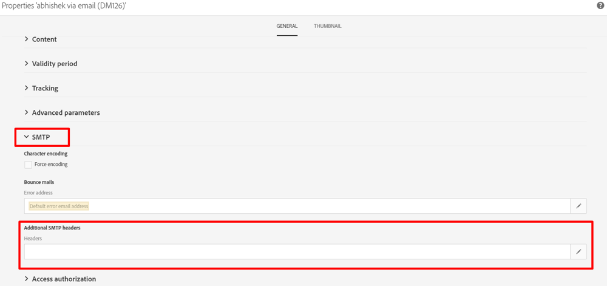

# Vad är rubriken List-Unsubscribe? Och hur kan detta implementeras i ACS?

Den här artikeln innehåller information om rubriken List-Unsubscribe och hur den kan implementeras i ACS.

## Beskrivning {#description}

### <b>Miljö</b>

- Campaign
- Campaign Standard

### <b>Problem/symtom</b>

<b>Vad är rubriken List-Unsubscribe? Och hur kan detta implementeras i ACS?</b>

Rubriken Lista - avsluta abonnemang är ett valfritt e-posthuvud som du kan lägga till i dina meddelanden. Det gör att abonnenterna kan se en avbeställningsknapp som de kan klicka på om de automatiskt vill sluta ta emot ditt e-postmeddelande.

List-Unsubscribe används av Gmail, Outlook.com med flera. Avsikten är att minska antalet klagomål genom att ge abonnenterna en annan metod för att på ett säkert sätt avbryta prenumerationen utan att detta påverkar det sändande anseendet negativt.

Rubriken List-Unsubscribe är lätt att sammanfoga med två andra alternativ som prenumeranter kan använda för att avbryta prenumerationen via e-post.

Alternativet List-Unsubscribe är inte:

- Skräppostknappen: När du klickar på skräppostknappen aktiveras ett klagomål som negativt påverkar ditt sändningsrykte.
- Länken för att avbryta prenumerationen i e-postprogrammet som är kreativ: Den här länken finns vanligtvis i sidfoten på din HTML som är kreativ och styrs av dig. Funktionen för att avbryta prenumerationen styrs dock av postlådeprovidern, om du har inkluderat den i rubrikerna.

Med andra ord, tänk på alternativet Lista - avsluta abonnemang som en tredje metod för att abonnenter ska kunna tas bort från din sändlista. Och det är ett alternativ som kan skydda ditt rykte genom att minska dina klagomål.

E-postrubriken List-Unsubscribe definieras i RFC 2369.

<b>Vad är rubriken List-Unsubscribe? </b>

`span style=Find No Results`

## Upplösning {#resolution}

<b>Implementering i ACS:</b>

I ACS är det bara möjligt att lägga till ett SMTP-huvud i leveransmallen (det kan inte läggas till direkt i leveransen).

Så här gör du:

1. Öppna och redigera egenskaperna för leveransmallen
2. Klicka på avsnittet SMTP och redigera rubrikerna från ytterligare SMTP-rubriker     
3. Lägg till följande kommandorad:    `List-Unsubscribe: <mailto:bounce@subdomain?subject=unsubscribe<%=escape(context.mimeMessageId) %>`

E-postadressen<b>*bounce@subdomain</b>*representerar <b>returadress</b>
