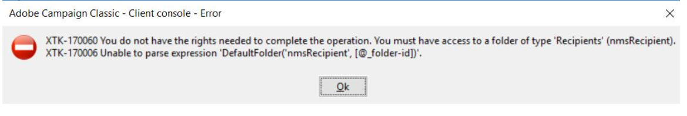

# Kan inte skapa [!UICONTROL Recipients]

## Beskrivning

<b>Miljö</b>
Campaign Classic

<b>Problem/symtom</b>
När du försöker skapa en mottagare från formuläret <b>[!UICONTROL Profiles and Targets] — [!UICONTROL Recipients]</b> på instansen får användarna behörighet att komma åt mappfelen.

## Upplösning

När vi har lagt till mottagarmappen högerklickar du på mappformuläret <b>[!UICONTROL Profiles and Targets]</b>började saker att fungera igen.

<b>Orsak</b>
Det här felet inträffar när standardmappen Mottagare visas i stället för att en separat visningsmapp skapas för den.
