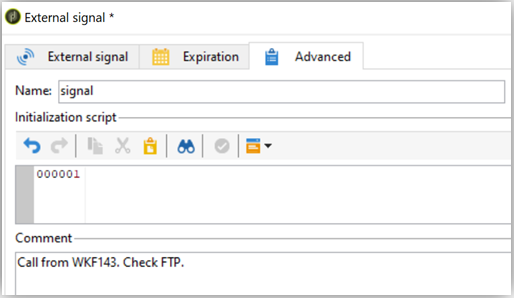

# Bästa praxis för arbetsflöden - konfiguration och övervakning inom Campaign Classic

I den här artikeln förklaras några tips om hur du konfigurerar och övervakar arbetsflöden i Adobe Campaign Classic.

## Beskrivning {#description}

### <b>Miljö</b>

- Adobe Campaign
- Adobe Campaign Classic

### <b>Problem</b>

För det mesta ingår arbetsflöden i de centrala funktionerna (inbyggda eller anpassade) i plattformen. Därför är det mycket viktigt att du är försiktig när du konfigurerar dem.

## Upplösning {#resolution}

### Allmän konfiguration

#### Organisation

Skapa arbetsflöden, till exempel import i tableXXX, i en anpassad mapp.

Det är bara om det allmänna arbetsflödet påverkar hela plattformen (till exempel rensning) som du kan lägga till i den inbyggda <b>Tekniska arbetsflöden</b> mapp.

#### Arbetsflödets namn

Som tidigare nämnts är det mycket viktigt att ge arbetsflöden egna namn och etiketter. Eftersom en operator inte alltid refererar till dokumentationen, fyll i arbetsflödets <b>description</b> fält för att sammanfatta processen som ska utföras.

Om arbetsflödet är en del av en process som innefattar flera arbetsflöden kan du vara tydlig när du anger en etikett. Att använda siffror är ett bra sätt att ordna arbetsflödena (efter etikett). Till exempel:

- 001 - Importera - Importera mottagare
- 002 - Import - Importförsäljning
- 003 - Importera - Importera försäljningsinformation
- 010 - Exportera - Exportera leveransloggar
- 011 - Export - loggar för exportspårning

#### Allvarlighetsgrad

Konfigurera ett arbetsflödes allvarlighetsgrad i arbetsflödesegenskaperna i <b>Körning</b> tab:

- Normal
- Produktion
- Kritisk

Om du anger den här informationen när du skapar ett arbetsflöde blir det lättare att förstå hur allvarlig den konfigurerade processen är.

#### Loggar

JavaScript-metoden `logInfo()` är en bra lösning för att felsöka ett arbetsflöde. Den är användbar, men den måste användas med försiktighet, särskilt för aktiviteter som ofta körs: den kan överlagra loggarna och avsevärt öka storleken på loggtabellen.

Men du kanske också behöver mer än `logInfo()`. Det finns ytterligare två lösningar.

<b>Behåll resultatet från mellanliggande populationer mellan två exekveringar</b>

Det här alternativet är tillgängligt i arbetsflödesegenskaperna <b>Allmänt</b> kan vara så användbar som den kan vara farlig. Det förhindrar att Adobe Campaign tar bort de temporära tabeller som skapas mellan två körningar. Det kan vara användbart för utvecklingsmiljöer, men får inte användas i produktionsmiljöer och bör övervakas. Om du behåller tillfälliga tabeller kan databasens storlek öka avsevärt och så småningom kan storleksgränsen nås. Dessutom kommer säkerhetskopieringen att bli långsammare.

<b>Inga arbetsflöden</b> i produktionen bör ha detta alternativ markerat när som helst.

<b><u>Logga SQL-frågor i journalen</u>:</b>

Finns i <b>Körning</b> på fliken med arbetsflödesegenskaper loggas alla SQL-frågor som genereras av verktyget från de olika aktiviteterna. Det är ett bra sätt att se vad som faktiskt utförs av plattformen. Detta alternativ bör dock endast användas tillfälligt under utvecklingen och inte aktiveras i produktionen.

#### Övervakning

Alla schemalagda arbetsflöden som körs i produktionsmiljöer bör övervakas för att varnas om ett fel uppstår.

I arbetsflödesegenskaperna väljer du <b>tillsynsgrupp</b>, antingen som standard&quot;Arbetsflödesansvarig&quot; eller en anpassad grupp. Se till att minst en operator tillhör den här gruppen, med ett konfigurerat e-postmeddelande.

<b><u>Lämna inte arbetsflödena pausade</u>:</b>

Om du skapar ett tillfälligt arbetsflöde måste du se till att det kan slutföras korrekt och inte vara i pausat läge. Om den pausas innebär det att du måste behålla de temporära tabellerna och på så sätt öka storleken på databasen.

### Inom arbetsflödet

#### Aktivitetsnamn

När du utvecklar ditt arbetsflöde får alla aktiviteter ett namn, liksom alla Adobe Campaign-objekt. När namnet genereras av verktyget rekommenderar vi att du byter namn på det med ett explicit namn när du konfigurerar det. Risken med att göra det senare är att det kan avbryta arbetsflödet med aktiviteter med hjälp av namnet på en annan tidigare aktivitet. Det skulle därför vara svårt att uppdatera namnen efteråt.

Aktivitetsnamnet finns i <b>Avancerat</b> -fliken. Låt dem inte ha namnet query, query1, query11, utan ge dem i stället explicita namn som `querySubscribedRecipients`. Det här namnet visas i journalen, och om tillämpligt i SQL-loggarna, och det hjälper till att felsöka arbetsflödet när det konfigureras.

#### JavaScript i en aktivitet

Du kanske vill lägga till JavaScript när du initierar en arbetsflödesaktivitet. Detta kan göras i en aktivitets <b>Avancerat</b> -fliken. Om du vill göra det enklare att spåra arbetsflödet rekommenderar vi att du använder dubbla streck i början och slutet av aktivitetsetiketten enligt följande: *— Min etikett —*

#### Signal

Oftast vet du inte varifrån signalen anropas. För att undvika det här problemet använder du <b>Kommentar</b> fält i <b>Avancerat</b> signalaktivitetens flik för att dokumentera det förväntade ursprunget för en signal för denna aktivitet.

#### Uppdatering av arbetsflöde

Ett produktionsarbetsflöde får inte uppdateras direkt. Om processen inte består av att skapa en kampanj med mallarbetsflöden, bör processerna först testas i en utvecklingsmiljö om det är möjligt. Det är först efter den här valideringen som arbetsflödet kan distribueras och startas i produktionen.

Arkiverade arbetsflöden kan sparas på dev- eller testplattformar i en <b>Arkiverad</b> men produktionen bör vara så ren som möjligt. Gamla arbetsflöden bör tas bort från produktionen om de är inaktiva.
