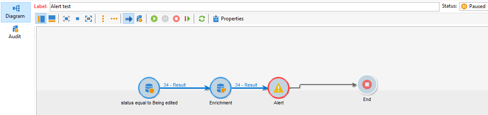

# Aviseringsaktivitet misslyckas när anrikningsaktivitet läggs till efter fråga i leveransregister

## Beskrivning

<b>Miljö</b>  Campaign Classic     <b>Problem/symtom</b>  Aviseringsaktiviteten misslyckas när en anrikningsaktivitet läggs till efter en frågeaktivitet.  

## Upplösning

För att lösa problemet skapades NEO-25157 för FoU, och problemet har sedan dess åtgärdats i version 9330.
<b>Orsak</b>

Detta är ett känt fel i build 9032, där en anrikningsaktivitet läggs till när en fråga skapas<b> </b>utförs på leveransregistret för leveransstatus. Vare sig berikningen gör något eller inte misslyckas varningsaktiviteten

Lyckades utan berikning:

Anrikningsfel:

Granskningsloggar: <b>*Det gick inte att läsa in leverans-ID \*\*\*\*\* till cache:...</b>*

