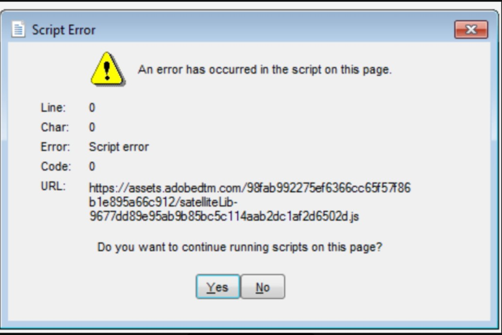

# Campaign Classic - Skriptfel/-varning vid inloggning

## Beskrivning

<b>Miljö</b>

Campaign Classic

<b>Problem/symtom</b>

- Campaign Classic visar ett skriptfel vid inloggning: &quot;Ett fel har inträffat med skriptet på den här sidan.&quot;
- Användaren kan logga in efter att ha klickat på Nej

## Upplösning

<b>Upplösning/tillfällig lösning</b>

Öka parametern Javascript maxMB: https://experienceleague.adobe.com/docs/campaign-classic/using/installing-campaign-classic/appendices/the-server-configuration-file.html?lang=en#javascript

<b>Orsak</b>

Standardinställningen för maxMB är 512. Detta anger den största tillåtna storleken i megabyte innan skräpinsamlaren körs. Ibland är den här inställningen inte tillräcklig, vilket orsakar skriptfel som kan korrigeras genom att minnestilldelningen ökas.
