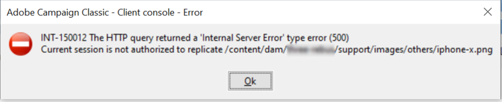

# AEM från Campaign-konsolen

## Beskrivning

Problembeskrivning = När AEM synkroniserar mallar till Campaign uppstår följande fel:

INT-150012 HTTP-frågan returnerade ett fel av typen &quot;Internal Server error&quot; (500) Aktuell session har inte behörighet att replikera /content/dam/xxx/support/images/others/ophone-x.png

Följande fel genereras i AEM 1 och Campaign 2: 103.08.2020 11:21:12.517 \*WARN\* qtp1229648141-8634 com.adobe.ams.environment.Indic.wcm.impl.AemEnvironmentIndicatorFilter accepteras inte för uri /mnt/overlay/granite/ui/content/shell/header/actions/pulse.data.json 03.08.201 1:21:14.038 \*WARN\* qtp1229648141-8819 com.adobe.ams.environment.Indic.wcm.impl.AemEnvironmentIndicatorFilter accepteras inte för uri /content/campaigns/xxx/mobile/xxx/samsung-note9.campai gn.link.json 03.08.202 0 11:21:14.046 \*ERROR\* 10.44.3.4 1596453674038 POST /content/campaigns/xxx/mobile/xxx/samsung-note9.campaign.link.json HTTP/1.1 com.adobe.cq.mcm.campaign.servlets.LinkServlet Cgt Excti on när link/unlink request java.lang.Nullnull användes PointerException: null på com.adobe.cq.mcm.campaign.impl.NewsletterManagerImpl.link(NewsletterManagerImpl.java:113) com.day.cq.mcm.cq-mcm-campaign:1.3.14 på com.adobe.cq.mcm.campaign.servlets.LinkServlet.handlePost(LinkServlet.java:76) com.day.cq.mcm.cq-mmmmm cm-campaign:1.3.14 at com.adobe.cq.mcm.campaign.servlets.LinkServlet.doPost(LinkServlet.java:50) com.day.cq.mcm.cq-mcm-campaign:1.3.14 at org.apache.sling.api.servlets.SlingAllMethodsServlet.mayService(SlingAllAllAll MethodsServlet.java:146) org.apache.sling.api:2.20.0

2 2020-08-05 05:56:17 Fel under synkroniseringsprocessen 2020-08-05 05:56:17 INT-150012 HTTP-frågan returnerade ett internt serverfel (500) (iRc=-53)

## Upplösning

Problembeskrivning =

Replikeringsrättigheter måste tilldelas kampanjens AEM användare, i AEM.  Vi gav läsbehörighet/skrivbehörighet/replikeringsrättigheter till Campaigns AEM användare under /content/campaign och /content/dam där kampanjresurserna fanns.
