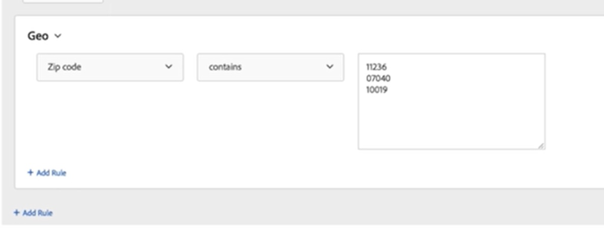

# Mål - Geo Audience-kvalificering misslyckas med flera parametrar

## Beskrivning

<b>Miljö</b>

- Adobe Target använder geoanpassning för att skapa en målgrupp
- Målgruppen använder flera parametrar för målinriktning

<b>Problem/symtom</b>

Det går inte att skapa målgrupper med hjälp av geoanpassning för att kvalificera besökare när flera parametrar för målgruppen har angetts

## Upplösning

<b>Upplösning/tillfällig lösning</b>

Bekräfta att varje parameter finns på sin egen rad i användargränssnittet för målgruppsskapande - [https://experienceleague.adobe.com/docs/target/using/audiences/create-audiences/categories-audiences/geo.html](https://experienceleague.adobe.com/docs/target/using/audiences/create-audiences/categories-audiences/geo.html?lang=en)

I skärmbilden nedan anges parametrarna korrekt, medan&quot;11236, 07040, 10019&quot; skulle misslyckas.

<b>Orsak</b>

När du använder flera parametrar måste varje parameter finnas på en separat rad i användargränssnittet.  Om du separerar parametrar med kommatecken, semikolon eller andra skiljetecken tolkas parametrarna som en enda, lång parameter.
