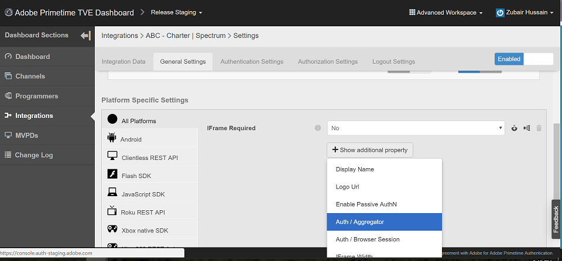

# Hur kan jag bekräfta om enkel inloggning (SSO) är aktiverad eller inaktiverad?

## Beskrivning {#description}

<b>Miljö</b>
Primetime

<b>Problem/symtom</b>
Prequal Staging, Prequal Production, Release Staging &amp; Release Production

Hur kan jag bekräfta om enkel inloggning (SSO) är aktiverad eller inaktiverad för min kanal?

## Upplösning {#resolution}

enkel inloggning (SSO) är aktiverat som standard för alla integreringar, men det kan konfigureras så att enkel inloggning är inaktiverad. Om du vill bekräfta om enkel inloggning är inaktiverad kan du granska integreringen i TVE Dashboard. Följande attribut anges till YES, om enkel inloggning har inaktiverats för en integrering av Channel - Multichannel Video Programming Distributor (MVPD): 
1. Auth / Aggregator — YES
2. Aktivera passiv AuthN - JA

Om inställningarna inte är inställda eller inställda på NO är enkel inloggning tillgänglig för integreringen. Om du ändrar dessa inställningar till NO kan du även aktivera enkel inloggning. Du kan hitta de här inställningarna genom att gå till den specifika integreringen (se till att den avancerade arbetsytan är markerad).
1. Klicka på den specifika integreringen i TVE Dashboard.
2. Välj fliken Allmänna inställningar och rulla nedåt.
3. Klicka på knappen <b>*Visa ytterligare egenskap</b>* för att visa värdet för Auth/Aggregator och Enable Passive AuthN. 
