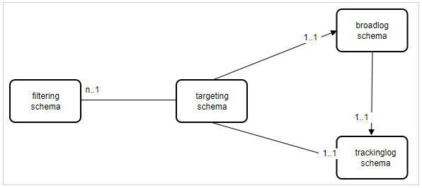

# Campaign Classic: Ett fel genereras när en profil förhandsgranskas från en leverans

## Beskrivning {#description}

<b>Miljö</b>
- Campaign Classic

<b>Problem/symtom</b>
Ett problem har rapporterats vid förhandsgranskning av en profil genom att välja<b>Målpopulation</b>&quot; i förhandsgranskningen för en leverans. Det fel som genereras anges nedan:

## Upplösning {#resolution}

Problemet är att en målmappning används baserat på ett utökat mottagarschema där leveranslogg och spårningsloggscheman inte har utökats för samma. En målmappning måste vara unik när det gäller mottagarschema och leveranslogg/loggscheman.

Det är omöjligt att använda flera målinriktningsscheman med samma `trackinglog` schema eftersom arbetsflödet för spårning inte kan stämma av data med mål-ID.

Om kunden inte vill använda `OOB` målmappning (med `nms:recipient`) rekommenderar vi två strategier:

- Om du vill använda en anpassad målinriktningsdimension måste du skapa en anpassad `broadLog/trackingLog` scheman använda `nms:broadlog` som en mall (c.f `nms:broadLogRcp, nms:broadLogSvc,` osv.)

   - målschema: `cus:recipient` (utökat från `nms:recipient` eller helt anpassad)
   - broadcast-loggschema: `cus:broadLogRcp` (utökat från `nms:broadLogRcp` eller helt anpassad)
   - loggschema för spårning: `cus:trackingLogRcp` (utökat från `nms:broadLogRcp` eller helt anpassad)
- Om du vill använda `OOB trackingLogRcp/broadLogRcp`måste målgruppsdimensionen vara `nms:recipient` och filtreringsdimensionen kan vara ett anpassat schema

