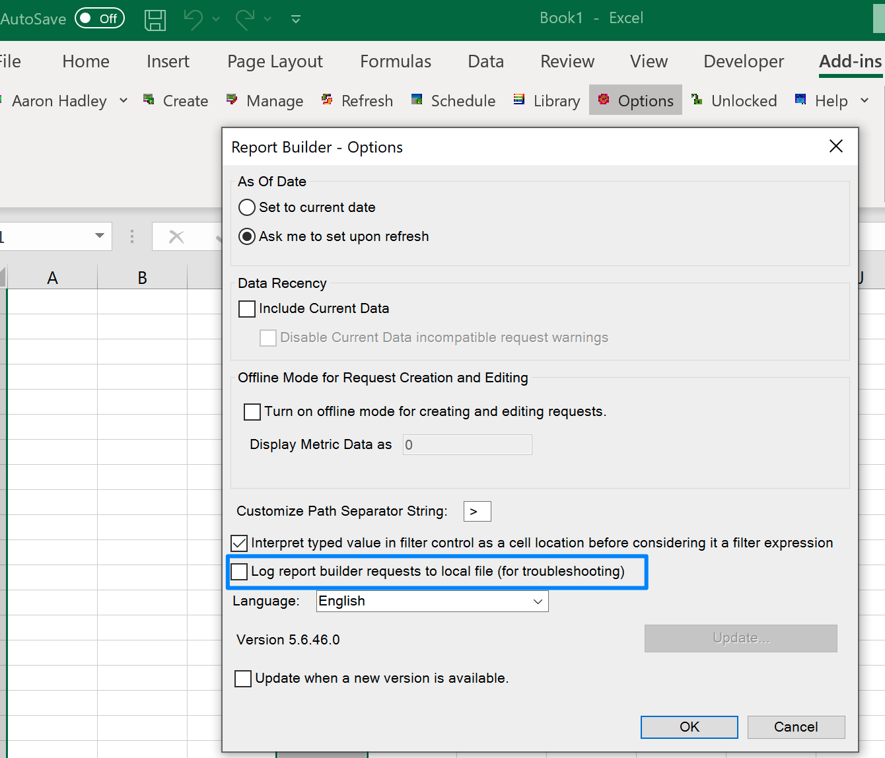

# Analyser - loggning i Report Builder utförligt

Om du har problem med att logga in på Adobe Analytics Report Builder (ARB) kan du lösa problemet genom att följa stegen i den här artikeln.

## Beskrivning {#description}

### <b>Miljö</b>

- Customer Journey Analytics
- Analytics 

### <b>Problem/symtom</b>

Hur du aktiverar inloggning på ARB när du loggar in för att kontrollera att loggningsrutan inte fungerar?

## Upplösning {#resolution}

Öppna registret i Windows: [https://support.microsoft.com/en-us/windows/how-to-open-registry-editor-in-windows-10-deab38e6-91d6-e0aa-4b7c-8878d9e07b11](https://support.microsoft.com/en-us/windows/how-to-open-registry-editor-in-windows-10-deab38e6-91d6-e0aa-4b7c-8878d9e07b11)

Hitta mappen i någon av följande mappar. Sökvägen och filnamnet kan vara lite olika beroende på vilken ARB-bitversion du har, osv.

Computer\HKEY_LOCAL_MACHINE\SOFTWARE\WOW6432Node\Adobe\ReportBuilder

ELLER

Computer\HKEY_LOCAL_MACHINE\SOFTWARE\Adobe\ReportBuilder

Högerklicka

Lägg till ny sträng

Ange värdenamn

Ange värdedata för debug

