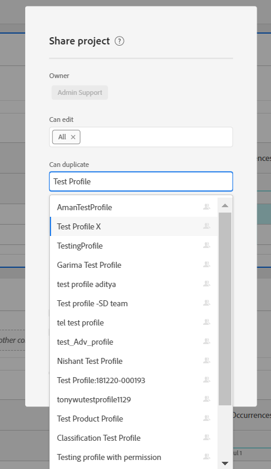

# Krav för att göra en produktprofil tillgänglig när du delar ett arbetsyteprojekt

## Beskrivning {#description}

<b>Miljö</b>
- Customer Journey Analytics
- Analytics 

<b>Problem/symtom</b>
En produktprofil som säger X kanske inte är tillgänglig i listrutan när ett arbetsyteprojekt delas med användare av X.

## Upplösning {#resolution}

För att en produktprofil ska bli tillgänglig i listrutan när du delar ett arbetsyteprojekt måste den ha/ha haft någon associerad Analytics-behörighet i Admin Console. När en slumpmässig behörighet har lagts till i produktprofilen X bör användaren börja se den i listrutan när ett Workspace-projekt delas.

I exemplet ovan - Produktprofilen &quot;Testa profil X&quot; var inte tillgänglig i listrutan när den skapades nyligen utan behörigheter. När vi lade till behörigheter blev de dock tillgängliga.

<b>Obs!</b> Om alla behörigheter som tilldelats produktprofilen X återkallas i Admin Console, skulle produktprofilen X <b>stilla </b>är fortfarande tillgängligt i listrutan för att dela projekt.

     
