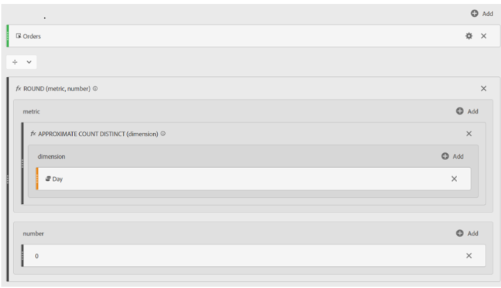

# Genomsnittlig daglig beställning i Adobe Analytics

Lär dig hur du kan ta bort genomsnittliga dagliga order i Adobe Analytics med funktionen &quot;Approximate Count Distinct&quot;.

## Beskrivning {#description}

### Miljö

Adobe Analytics

### Problem/symtom

Hur man beräknar genomsnittliga dagliga order i Adobe Analytics.

## Upplösning {#resolution}

<u><b>ANSVARSFRIHET</b></u>: Nedan används funktionen&quot;APPROXIMATE COUNT DISTINCT&quot;. Som namnet antyder är detta inte ett 100-procentigt korrekt mått, men det är garanterat att resultatet blir inom 5 % av det faktiska värdet 95 % av tiden.

