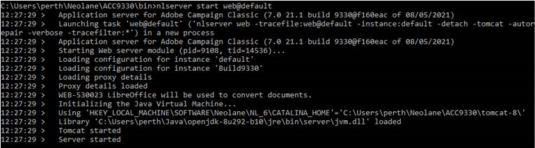

# ACC v7-fel: &quot;JVM-510037 Det går inte att hitta det dynamiska Java-biblioteket.&quot;


Det finns två lösningar: du kan antingen lägga till JavaSoft-nyckeln manuellt i Windows-registret under `Computer\HKEY_LOCAL_MACHINE\SOFTWARE`eller så kan du använda två Windows-miljövariabler som anger var `jvm.dll` -filen kan hittas av webbmodulen.

## Beskrivning {#description}


### <b>Miljö</b>

Adobe Campaign Classic v7 (ACC v7)


### <b>Problem/symtom</b>

<b>Använd skiftläge</b> - Det här problemet uppstod när Oracle-JDK skulle ersättas med Open JDK på Campaign-instanser som körs i Windows.

I exemplet hade Oraclet JDK v1.8.0.191 installerat på alla Windows Campaign-instanser. När Oracle-JDK har ersatts med Open JDK i någon av Campaign-instanserna kunde WEB inte starta och följande fel uppstod:

<b>`JVM-510037 Cannot find the Java dynamic library. Check that a JDK or a JRE is installed on the machine. (iRc=-53)`</b>

Java installeras dock korrekt med rätt sökvägs- och JAVA_HOME-miljövariabler.


## Upplösning {#resolution}


För att kunna köra webbmodulen måste det dynamiska JVM-biblioteket vara synligt för Campaign. Genom att ta bort Oracle-JDK tas JavaSoft-nyckeln bort från Windows-registret och alla referenser till det JVM-biblioteket går också förlorade.

Det finns två lösningar på problemet:

### <u>Lösning 1</u>

Du kan lägga till JavaSoft-nyckeln manuellt i Windows-registret under `Computer\HKEY_LOCAL_MACHINE\SOFTWARE`.


Här är ett exempel (med `OpenJDK 1.8_292`) av vad du behöver lägga till:

`Windows Registry Editor Version 5.00`

`[ HKEY_LOCAL_MACHINE\SOFTWARE\JavaSoft]`


```
[ HKEY_LOCAL_MACHINE\SOFTWARE\JavaSoft\Java Runtime Environment] "CurrentVersion"="1.8""BrowserJavaVersion"="11.301.2"
```


```
[ HKEY_LOCAL_MACHINE\SOFTWARE\JavaSoft\Java Runtime Environment\1.8] "MicroVersion"="0""RuntimeLib"="C:\\Users\\perth\\Java\\openjdk-8u292-b10\\jre\\bin\\server\\jvm.dll""JavaHome"="C:\\Users\\perth\\Java\\openjdk-8u292-b10\\jre"
```


```
[ HKEY_LOCAL_MACHINE\SOFTWARE\JavaSoft\Java Runtime Environment\1.8.0_292] "MicroVersion"="0""RuntimeLib"="C:\\Users\\perth\\Java\\openjdk-8u292-b10\\jre\\bin\\server\\jvm.dll""JavaHome"="C:\\Users\\perth\\Java\\openjdk-8u292-b10\\jre"
```


 
Och följande sökvägsmapp har lagts till i <b>`Path` </b>miljövariabel.

`C:\Users\perth\Java\openjdk-8u292-b10\bin`

Webbmodulen ska kunna starta som förväntat:



### <u>Lösning nr 2</u>

Användning av två Windows-miljövariabler kan definieras för att ange var `jvm.dll` -filen kan hittas av webbmodulen.

Variablerna är:

- `USEENV=1`
- `JVMLIBDIR=<the path of the jvm.dll file>`


Här är ett exempel:


Observera att `JVMLIBDIR` visas från loggen om den utförliga loggningen är aktiverad i modulen Webb.
