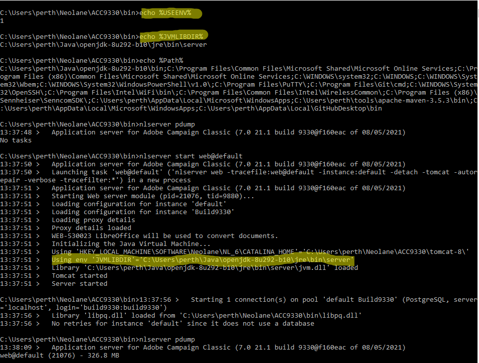

# JVM-510037 Det går inte att hitta det dynamiska Java-biblioteket.

## Beskrivning {#description}

<b>Miljö</b>
- Campaign Classic v7


<b>Problem/symtom</b>
<b>Använd skiftläge</b> - Ett problem har rapporterats när Oracle-JDK ersätts med Open JDK för Campaign-instanser som körs i Windows.

Kunden har för närvarande Oracle JDK v1.8.0.191 installerat på alla Windows Campaign-instanser. När Oracle-JDK har ersatts med Open JDK i någon av Campaign-instanserna har dock WEB inte kunnat börja med följande fel:

<b>`JVM-510037 Cannot find the Java dynamic library. Check that a JDK or a JRE is installed on the machine. (iRc=-53)`</b>

Java installeras dock korrekt med rätt sökvägs- och JAVA_HOME-miljövariabler.


## Upplösning {#resolution}


För att kunna köra webbmodulen måste det dynamiska JVM-biblioteket vara synligt för Campaign. Genom att ta bort Oracle-JDK tas JavaSoft-nyckeln bort från Windows-registret och alla referenser till det JVM-biblioteket går också förlorade.

Det finns två lösningar på problemet:

För det första kan du lägga till JavaSoft-nyckeln manuellt i Windows-registret under Dator\HKEY_LOCAL_MACHINE\SOFTWARE.


Här är ett exempel (med `OpenJDK 1.8_292`) av vad du behöver lägga till:

`Windows Registry Editor Version 5.00`

`HKEY_LOCAL_MACHINE\SOFTWARE\JavaSoft`


```
HKEY_LOCAL_MACHINE\SOFTWARE\JavaSoft\Java Runtime Environment"CurrentVersion"="1.8""BrowserJavaVersion"="11.301.2"
```


```
HKEY_LOCAL_MACHINE\SOFTWARE\JavaSoft\Java Runtime Environment\1.8"MicroVersion"="0""RuntimeLib"="C:\\Users\\perth\\Java\\openjdk-8u292-b10\\jre\\bin\\server\\jvm.dll""JavaHome"="C:\\Users\\perth\\Java\\openjdk-8u292-b10\\jre"
```


```
HKEY_LOCAL_MACHINE\SOFTWARE\JavaSoft\Java Runtime Environment\1.8.0_292"MicroVersion"="0""RuntimeLib"="C:\\Users\\perth\\Java\\openjdk-8u292-b10\\jre\\bin\\server\\jvm.dll""JavaHome"="C:\\Users\\perth\\Java\\openjdk-8u292-b10\\jre"
```


 
Och följande sökvägsmapp har lagts till i <b>Bana </b>systemvariabel.

`C:\Users\perth\Java\openjdk-8u292-b10\bin`

Webbmodulen ska kunna starta som förväntat:


För det andra kan användningen av två Windows-miljövariabler definieras för att ange var filen jvm.dll finns i webbmodulen.

Variablerna är:

- USEENV=1
- JVMLIBDIR=*sökvägen till filen jvm.dll*


Här är ett exempel:



Observera att JVMLIBDIR kommer att synas från loggen om den utförliga loggningen är aktiverad i webbmodulen.
