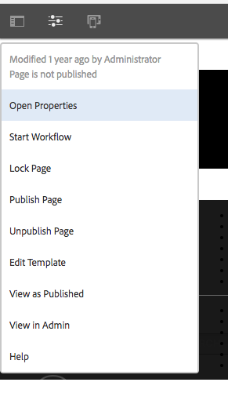

# Dispatcher Vanity-URL:er


Det här dokumentet hjälper dig att förstå hur AEM hanterar vanlighets-URL:er och vissa andra tekniker, som att använda omskrivningsregler för att mappa innehåll närmare leveranskanten.

## Beskrivning {#description}


### Miljö

Experience Manager

### Problem/symtom

Hur hanterar AEM vanity urls? Finns det ytterligare tekniker för att kartlägga innehåll som ligger närmare leveranskanterna?

#### Vad är Vanity-URL:er?

När du har innehåll som finns i en mappstruktur som är vettig finns det inte alltid i en URL som är enkel att referera till. Vanity-URL:er fungerar som genvägar. Kortare eller unika URL:er som refererar till det verkliga innehållet.

Ett exempel: <b>*/aboutus</b> spetsig <b>/content/we-retail/us/en/about-us.html</b>*

AEM författare har möjlighet att ange egenskaper för målarens URL för ett visst innehåll i AEM och publicera det.

För att den här funktionen ska fungera måste du justera dispatcherfiltren så att du kan hantera vantheten. Detta är orimligt om du justerar dispatcherkonfigurationsfilerna med den hastighet som författare måste konfigurera dessa poster för vanlighetssidan.

Av den anledningen har dispatchermodulen en funktion för att automatiskt tillåta allt som listas som en avvikelse i innehållsträdet.


## Upplösning {#resolution}


### Hur fungerar det?

#### URL för redigering av Vanity

Författaren besöker en sida i AEM och besöker sidegenskaperna och lägger till poster i delen med huvudadressen.

När de har sparat sina ändringar och aktiverat sidan tilldelas den här sidan huvudrollen.

<b><u>Pekgränssnitt</u>:</b>




<b><u>Classic Content Finder</u>:</b>


<b>Obs!</b> Vänligen förstå att detta är mycket känsligt för namnutrymmesproblem. Vanity-tävlingsbidragen är globala till alla sidor, det här är bara ett av de korta brister du måste planera tillfälliga lösningar för. Vi kommer att förklara några av dem senare.

<b><u>Resurslösningar/mappning</u>:</b>

Alla poster i vanity är sling map-post för en intern omdirigering. Dessa kartor visas i AEM förekomster Felix-konsolen (`/system/console/jcrresolver`)

Här är en skärmbild av en kartpost som har skapats av en vanity-post:


I ovanstående exempel när vi ber AEM instansen att besöka `/aboutus` kommer det att leda till `/content/we-retail/us/en/about-us.html`

<b><u>Filter som automatiskt tillåter sändning</u>:</b>

Dispatcher i ett säkert läge filtrerar bort begäranden på sökvägen/genom Dispatcher eftersom det är roten till JCR-trädet.

Det är viktigt att se till att utgivare bara tillåter innehåll från `/content` och andra säkra banor osv. och inte banor som `/system` osv.

Här är busken, fånighet-URL:er som finns i basmappen för / så hur kan vi låta dem nå utgivare samtidigt som de är säkra?

Den enkla dispatchern har en autofilterfunktion och du måste installera ett AEM och sedan konfigurera Dispatcher så att den pekar på den paketsidan. Besök [här](https://experience.adobe.com/#/downloads/content/software-distribution/en/aem.html?package=/content/software-distribution/en/details.html/content/dam/aem/public/adobe/packages/granite/vanityurls-components) för AEM.

Dispatcher har ett konfigurationsavsnitt i sin servergruppsfil:


```
/vanity_urls {      /url    "/libs/granite/dispatcher/content/vanityUrls.html"
  /file   "/tmp/vanity_urls"      /delay  300 }
```


Den här konfigurationen anger för Dispatcher att hämta den här URL:en från dess AEM instans som den skickar var 300:e sekund för att hämta listan över objekt som vi vill tillåta igenom.

Den lagrar sin cache för svaret i argumentet /file så i det här exemplet /tmp/vanity_urls

Så om du besöker den AEM instansen på URI:n ser du vad den hämtar:


Det är en superenkel lista.

#### Skriv om regler som vanlighetsregler

Varför skulle vi använda omskrivningsregler istället för standardmekanismen som är inbyggd i AEM som beskrivs ovan?

Förklara enkelt namnutrymmesproblem, prestanda och logik på högre nivå som kan hanteras bättre.

Låt oss gå igenom ett exempel på vanity-posten `/aboutus` till innehållet `/content/we-retail/us/en/about-us.html` med Apache `mod_rewrite` för att uppnå detta.

`RewriteRule /aboutus /content/we-retail/us/en/about-us.html PT,L,NC`

Den här regeln kommer att leta efter fåfängligheten `/aboutus` och hämta den fullständiga sökvägen från renderaren med PT-flaggan (Pass Through).

Den kommer också att sluta bearbeta alla andra regler L-flaggor (sista), vilket innebär att den inte behöver gå igenom en stor lista med regler som JCR Resolving måste göra.

Förutom att du inte behöver göra en proxy för begäran och vänta på att den AEM utgivaren ska svara på de här två elementen i den här metoden gör det mycket mer prestandaförbättrande.

Sedan är ikonen här NC-flaggan (ingen skiftlägeskänslig), vilket innebär att en kund flubar URI:n med `/Aboutus` i stället för `/aboutus` kommer det fortfarande att fungera och rätt sida kan hämtas.

Om du vill skapa en omskrivningsregel för att göra detta skapar du en konfigurationsfil på Dispatcher (exempel: `/etc/httpd/conf.d/rewrites/examplevanity_rewrite.rules`) och inkludera den i `.vhost` -fil som hanterar domänen som behöver dessa vanity-URL:er för att kunna användas.

Här är ett exempel på ett kodfragment av SSI:


```
/etc/httpd/conf.d/enabled_vhosts/we-retail.vhost
 VirtualHost *:80    ServerName    weretail.com    ServerAlias 

www.weretail.com        ........ SNIP ........     IfModule mod_rewrite.c   

   ReWriteEngine    on       LogLevel warn rewrite:info

Include /etc/httpd/conf.d/rewrites/examplevanity_rewrite.rules      / IfModule         
   ........ SNIP ......../VirtualHost
```


### Vilken metod och var den ska användas?

S. Att använda AEM för att styra poster för vanity har följande fördelar:

- Författare kan skapa dem direkt
- De lever med innehållet och kan paketeras ihop med innehållet


B. Använda `mod_rewrite` för att kontrollera poster i vanity har följande fördelar:

- Snabbare lösning av innehåll
- Nära i kanten av begäran om slutanvändarinnehåll
- Mer utbyggbarhet och alternativ för att styra hur innehåll mappas under andra förhållanden
- Kan vara skiftlägeskänsligt


C. Använd båda metoderna, men här följer råd och kriterier som ska användas när:

- Om vanligheten är tillfällig och har låg planerad trafik ska du använda den inbyggda AEM
- Om vanligheten är en stapelslutpunkt som inte ändras ofta och ofta används ska du använda en `mod_rewrite` regel.
- Om namnutrymmet vanity (till exempel: `/aboutus`) måste återanvändas för många varumärken i samma AEM och sedan använda omskrivningsregler.


<b>Obs!</b> Om du vill använda AEM-funktionen och undvika namnutrymme kan du göra en namnkonvention. Använda vanity-URL:er som är kapslade som `/brand1/aboutus, brand2/aboutus, brand3/aboutus`
