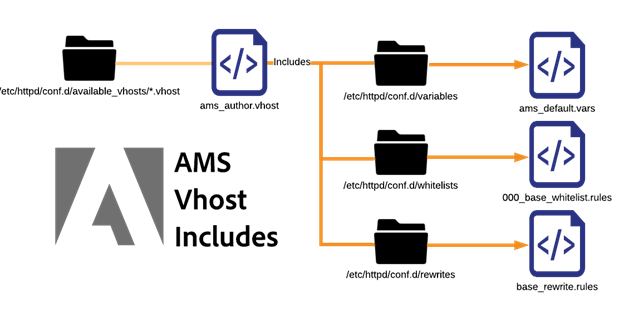

# Förklaring av konfigurationsfiler | AEM


Utforska en detaljerad beskrivning av konfigurationsfiler i Adobe Managed Services Dispatcher-server. Identifiera deras betydelse, namngivningskonventioner och praktiska tillämpningar.

## Beskrivning {#description}


### Miljö

Experience Manager

### Problem/symtom

Det här dokumentet kommer att innehålla en beskrivning och en beskrivning av alla konfigurationsfiler som distribueras i en standardserver för inbyggd dispatcher som distribueras i Adobe Managed Services. Deras användning, namnkonventioner osv.

<b>Namngivningskonvention</b>

Apache Webserver bryr sig egentligen inte om vad filtillägget är för en fil när den används med en include- eller include-sats. Att namnge dem på rätt sätt med namn som eliminerar konflikter och förvirring hjälper till. Namn som används beskriver filens användningsområde och gör livet enklare. Om allt heter .conf blir det förvirrande. Vi vill undvika dåligt namngivna filer och tillägg.

Nedan finns en lista över de olika anpassade filtilläggen och namnkonventioner som används i en vanlig AMS-konfigurerad dispatcher.

<u>Filer i conf.d/</u>


| Fil | Filmål | Beskrivning |
| --- | --- | --- |
| `<` FILNAMN`>` .conf | /etc/httpd/conf.d/ | En standardinstallation av Enterprise Linux använder det här filtillägget och ta med mapp som en plats för att åsidosätta inställningarna i httpd.conf och göra det möjligt att lägga till ytterligare funktioner på global nivå i Apache. |
| `<` FILNAMN`>` .vhost | Mellanlagrad: /etc/httpd/conf.d/available_vhosts/<br><br>Aktiv:<br><br>/etc/httpd/conf.d/enabled_vhosts/<br><br><u style="box-sizing: border-box; border: 0 none">*Obs! .vhost-filer ska inte kopieras till mappen enabled_vhosts, men använd symboler för en relativ sökväg till filen available_vhosts/ .vhost</u> | \*.vhost-filer (Virtual Host) är `<` VirtualHosts `>`  poster som matchar värdnamn och som tillåter att Apache hanterar varje domäntrafik med olika regler. Från .vhost-filen inkluderas andra filer som omskrivningar, vitlistning osv. |
| `<` FILNAMN`>` _rewrite.rules | /etc/httpd/conf.d/rewrites/ | `*_rewrite.rules` fillagring `mod_rewrite` regler som ska inkluderas och användas explicit av en värdfil |
| `<` FILNAMN`>` _vitlista.regler | /etc/httpd/conf.d/whitelists/ | \*_ipwhitelist.rules-filer finns i \*.vhost-filerna. Den innehåller IP-regex eller tillåter nekanderegler för att tillåta vitlistning av IP. Om du försöker begränsa visningen av ett virtuellt värdsystem baserat på IP-adresser genererar du en av dessa filer och tar med den från din \*.vhost-fil |


<u>Filer i conf.modules.d/</u>


| Fil | Filmål | Beskrivning |
| --- | --- | --- |
| `<` FILNAMN`>` .any | /etc/httpd/conf.dispatcher.d/ | AEM Dispatcher Apache Module hämtar inställningarna från \*.any-filer. Standardfilen för överordnad inkludering är conf.dispatcher.d/dispatcher.any |
| `<` FILNAMN`>` _farm.any | <u>Mellanlagrad</u>:<br><br>/etc/httpd/conf.dispatcher.d/available_farm/<br><br><u>Aktiv</u>:<br><br>/etc/httpd/conf.dispatcher.d/enabled_farm/<br><br><u style="box-sizing: border-box; border: 0 none">*Obs! Dessa servergruppsfiler ska inte kopieras till mappen enabled_farm, men de använder länkar till en relativ sökväg till filen available_farm/ _farm.any</u> | \*_farm.any-filer inkluderas i filen conf.dispatcher.d/dispatcher.any. Dessa överordnade gruppfiler finns för att styra modulbeteendet för varje rendering eller webbplatstyp. Filerna skapas i katalogen available_farm och aktiveras med en länk till katalogen enabled_farm.<br><br>De inkluderas automatiskt efter namn från dispatcher.any-filen.<br><br>Baslinjegruppsfiler börjar med 000_ för att se till att de läses in först.<br><br>Anpassade servergruppsfiler ska läsas in efter att deras nummerschema har startats på 100_ för att säkerställa korrekt inkluderingsbeteende. |
| `<` FILNAMN`>` _filters.any | /etc/httpd/conf.dispatcher.d/filters/ | \*_filters.Alla filer inkluderas inifrån filen conf.dispatcher.d/enabled_farm/\*_farm.any. Varje gård har en uppsättning regler som förändrar vilken trafik som ska filtreras bort och inte övergå till renderarna. |
| `<` FILNAMN`>` _vhosts.any | /etc/httpd/conf.dispatcher.d/vhosts/ | \*_vhosts.any-filer inkluderas inifrån filen conf.dispatcher.d/enabled_farm/\*_farm.any. De här filerna är en lista över värdnamn eller uri-sökvägar som matchas av blobbmatchning för att avgöra vilken renderare som ska användas för begäran |
| `<` FILNAMN`>` _cache.any | /etc/httpd/conf.dispatcher.d/cache/ | \*_cache.Alla filer inkluderas från filen conf.dispatcher.d/enabled_farm/\*_farm.any. De här filerna anger vilka objekt som cachelagras och vilka som inte |
| `<` FILNAMN`>` _invalidate_allowed.any | /etc/httpd/conf.dispatcher.d/cache/ | \*_invalidate_allowed.any-filer finns i filen conf.dispatcher.d/enabled_farm/\*_farm.any. De anger vilka IP-adresser som tillåts skicka begäranden om tömning och ogiltigförklaring. |
| `<` FILNAMN`>` _clientheaders.any | /etc/httpd/conf.dispatcher.d/clientheaders/ | \*_clientheaders.any-filer finns i filen conf.dispatcher.d/enabled_farm/\*_farm.any. De anger vilka klientrubriker som ska skickas till varje återgivning. |
| `<` FILNAMN`>` _renders.any | /etc/httpd/conf.dispatcher.d/renders/ | \*_renders.Alla filer finns i filen conf.dispatcher.d/enabled_farm/\*_farm.any. De anger inställningar för IP, port och timeout för varje återgivning. En korrekt återgivare kan vara en LiveCycle-server eller något annat AEM system där avsändaren kan hämta/proxyköra begäranden från |


<b>Undantagna problem</b>

När du följer namnkonventionen kan du undvika att göra misstag som kan få katastrofala resultat. Vi ska ta upp några exempel.

<u>Exempel på problem</u>

Som ett exempel på en plats för ExampleCo skapades två konfigurationsfiler av utvecklarna av dispatcherkonfigurationerna.

`/etc/httpd/conf.d/exampleco.conf`


```
<VirtualHost *:80>

    ServerName  "exampleco"

    ServerAlias "www.exampleco.com"

    .......... SNIP ...............

    <IfModule mod_rewrite.c>

        ReWriteEngine   on

        LogLevel warn rewrite:trace1

        Include /etc/httpd/conf.d/rewrites/exampleco.conf

    </IfModule>

</VirtualHost>
```


`/etc/httpd/conf.d/rewrites/exampleco.conf`


```
RewriteRule /$ /content/exampleco/en.html [ PT,L] 

RewriteRule /robots.txt$ /content/dam/exampleco/robots.txt [ PT,L]
```


<b>POTENTIELL FARA</b>

<b>A. Filnamnen är desamma</b>

Om värdfilen av misstag placeras i mappen för omskrivningar och filen för omskrivningar placeras i mappen vhosts. Det verkar ha distribuerats korrekt av filnamnet, men Apache genererar ett fel och problemet kommer inte att vara omedelbart synligt.

<b>Hur blir detta vanligtvis ett problem?</b>

Om de två filerna laddas ned till samma plats kan de antingen skriva över sig själva eller göra det omöjligt att särskilja, vilket gör distributionsprocessen till en mardröm.

<b>B. Filtilläggen är desamma och tar automatiskt med benen</b>

Filtilläggen är desamma och använder automatiskt inkluderat tillägg som Apache automatiskt inkluderar alla .conf-filer i många av standardmapparna.

<b>Hur blir detta vanligtvis ett problem?</b>

Om värdfilen med tillägget .conf placeras i mappen /etc/httpd/conf.d/ försöker den att läsa in den i minnet på Apache, vilket vanligtvis är ok, men om den nya regelfilen med tillägget .conf placeras i `/etc/httpd/conf.d/` kommer programmet att inkluderas automatiskt och användas globalt, vilket ger förvirrande och oönskade resultat.


## Upplösning {#resolution}


Namnge filerna baserat på vad de gör och säkert ut ur namnutrymmet för automatiska inkluderingsregler.

- Om det är ett virtuellt värdfilnamn får det ett `.vhost` som tillägget.
- Om det är en omskrivningsregelfil ger du den ett namn `<site>_rewrite.rules` som suffix och tillägg. Den här namnkonventionen visar vilken webbplats den är avsedd för och att det är en uppsättning regler för omskrivning.
- Om det är en IP-vitlistregelfil ger du den ett namn `<description>_whitelist.rules` som suffix och tillägg. Den här namnkonventionen ger en viss beskrivning av vad den är till för och att det är en uppsättning IP-matchningsregler.


Om du använder dessa namnkonventioner undviker du problem om en fil flyttas till en katalog för automatisk infogning som den inte tillhör.

Du kan till exempel placera en fil med namnet .rules, .any eller .vhost i mappen för automatisk infogning i `/etc/httpd/conf.d/` skulle inte ha någon påverkan.

Om en distributionsändringsbegäran säger `please deploy exampleco_rewrite.rules to production dispatchers` personen som distribuerar ändringarna kan redan veta att de inte lägger till en ny plats. De uppdaterar bara skrivreglerna som anges av filnamnet.

<b>Inkludera order</b>

När du utökar funktioner och konfigurationer i Apache Webserver som är installerad på Enterprise Linux har du en del viktiga <b>inkludera order</b> du kommer att vilja förstå.

S. <u>Apache-baslinjen innehåller</u>

Apache-binärfilen börjar med `httpd.conf` som gör `includeoptional` till `conf.d/*.conf` och `conf.modules.d/*.conf` kataloger.


I diagrammet ovan ser httpd-binärfilen bara ut mot `httpd.conf` som det är konfigurationsfil. Filen innehåller följande programsatser:


```
Include conf.modules.d/*.conf
IncludeOptional conf.d/*.conf
```


B. <u>AMS-toppnivån omfattar</u>

När vi tillämpade vår standard lade vi till ytterligare filtyper och inkluderar våra egna.

Här är AMS-originalkataloger och toppnivån innehåller


Vi bygger vidare på Apache baslinje och visar hur AMS skapade ytterligare mappar och inkluderingar på den översta nivån för `conf.d` mappar samt modulspecifika kataloger som är kapslade under `/etc/httpd/conf.dispatcher.d/`

När apache läses in kommer det att dra in `/etc/httpd/conf.modules.d/02-dispatcher.conf` och den filen kommer att innehålla den binära filen `/etc/httpd/modules/mod_dispatcher.so` till att det är igång.


```
LoadModule dispatcher_module modules/mod_dispatcher.so
```


Använda modulen i `</VirtualHost>` vi släpper en konfigurationsfil i `/etc/httpd/conf.d/` namngiven `dispatcher_vhost.conf` och i den här filen visas de grundläggande parametrar som behövs för att modulen ska fungera:


```
<IfModule disp_apache2.c>
DispatcherConfig conf.dispatcher.d /dispatcher .any
...SNIP...
</IfModule>
```


Som du kan se ovan omfattar detta den översta nivån dispatcher.vilken fil som helst för vår dispatcher-modul för att hämta dess konfigurationsfiler från `/etc/httpd/conf.dispatcher.d/dispatcher.any`

Tänk på innehållet i den här filen:


```
/farms {
 $include "enabled_farms/*_farm.any"
}
```


Dispatcher på den översta nivån.alla filer innehåller alla aktiverade servergruppsfiler som finns i `/etc/httpd/conf.dispatcher.d/enabled_farms/` med filnamnet `<FILENAME>_farm.any` som följer vår standardnamnkonvention.

Senare i `dispatcher_vhost.conf` som nämndes tidigare gör vi också en include-sats för att aktivera varje aktiverad virtuell värdfil som finns i `/etc/httpd/conf.d/enabled_vhosts/` med filnamnet `<FILENAME>.vhost` som följer vår standardnamnkonvention.


```
IncludeOptional /etc/httpd/conf.d/enabled_vhosts/*.vhost
```


I var och en av våra .vhost-filer kommer du att märka att dispatchermodulen initieras som en standardfilhanterare för en katalog. Här är ett exempel på en .vhost-fil som visar syntaxen:


```
<VirtualHost *:80>
 ServerName "weretail"
 ServerAlias www.weretail.com weretail.com
 <Directory />
 <IfModule disp_apache2.c>
 ....SNIP....
 SetHandler dispatcher-handler
 </IfModule>
 ....SNIP....
 </Directory>
 ....SNIP....
</VirtualHost>
```


När den översta nivån innehåller en lösning har de andra underinkluderingar som är värda att nämnas. Här följer ett diagram på hög nivå över hur servergrupperna och värdfilerna innehåller andra underelement

C. <u>AMS virtuella värd innehåller</u>



När det finns några .vhost-filer från `/etc/httpd/conf.d/availabled_vhosts/` katalogen får en länk till `/etc/httpd/conf.d/enabled_vhosts/` katalogen som de ska användas i den konfiguration som körs.

.vhost-filerna har underinkluderingar som baseras på de vanligaste bitarna som vi har hittat. Saker som variabler, vitlistor och skrivregler.

.vhost-filen kommer att innehålla programsatser för varje fil baserat på var de måste inkluderas i .vhost-filen. Här följer ett exempel på syntax för en Vhost-fil som en bra referens:


```
Include /etc/httpd/conf .d /variables/weretail .vars VirtualHost *:80
ServerName "${MAIN_DOMAIN}"
Directory / Include /etc/httpd/conf .d /whitelists/weretail *_whitelist.rules
IfModule disp_apache2.c
....SNIP....
SetHandler dispatcher-handler
/IfModule
....SNIP....
/Directory
....SNIP....
IfModule mod_rewrite.c
ReWriteEngine on
LogLevel warn rewrite:trace1
Include /etc/httpd/conf .d /rewrites/weretail_rewrite .rules
/IfModule /VirtualHost
```


Som du ser i exemplet ovan finns det en inkluderingsfunktion för de variabler som behövs i konfigurationsfilen och som används senare.

I filen `/etc/httpd/conf.d/variables/weretail.vars` vi kan se vilka variabler som är definierade:


```
Define MAIN_DOMAIN dev.weretail.com
```


Du kan också se en rad som innehåller en lista med whitelist.rules-filer som begränsar vilka som kan visa innehållet baserat på olika vitlistvillkor. Här kan du se innehållet i en av de vita listfilerna `/etc/httpd/conf.d/whitelists/weretail_mainoffice_whitelist.rules`:


```
<RequireAny>
 Require ip 192.150.16.0/23
</RequireAny>
```


Du kan även se en rad som innehåller en uppsättning regler för omskrivning. Låt oss titta på innehållet i `weretail_rewrite.rules` fil:


```
RewriteRule /robots.txt$ /content/dam/weretail/robots.txt [ NC,PT] 
RewriteCond %{SERVER_NAME} brand1.weretail.net [ NC] 
RewriteRule /favicon.ico$ /content/dam/weretail/favicon.ico [ NC,PT] 
RewriteCond %{SERVER_NAME} brand2.weretail.com [ NC] 
RewriteRule /sitemap.xml$ /content/weretail/general/sitemap.xml [ NC,PT] 
RewriteRule /logo.jpg$ /content/dam/weretail/general/logo.jpg [ NC,PT]
```


D. <u>AMS-servergruppen innehåller</u>


När `<FILENAME>_farm.any` filer från `/etc/httpd/conf.dispatcher.d/available_farms/` katalogen får en länk till `/etc/httpd/conf.dispatcher.d/enabled_farms/` katalogen som de ska användas i den konfiguration som körs.

Servergruppsfilerna har undergrupper baserade på [toppnivåavsnitt i servergruppen](https://experienceleague.adobe.com/docs/experience-manager-dispatcher/using/configuring/dispatcher-configuration.html?lang=en#defining-farms-farms) som cache, clientheaders, filters, renders och vhosts.

The `<FILENAME>_farm.any` filerna kommer att innehålla programsatser för varje fil baserat på var de måste inkluderas i servergruppsfilen. Här är ett exempel på syntax för en `<FILENAME>_farm.any` som en bra referens:


```
/weretailfarm {
 /clientheaders {
 $include "/etc/httpd/conf.dispatcher.d/clientheaders/ams_publish_clientheaders.any"
 $include "/etc/httpd/conf.dispatcher.d/clientheaders/ams_common_clientheaders.any"
 }
 /virtualhosts {
 $include "/etc/httpd/conf.dispatcher.d/vhosts/weretail_vhosts.any"
 }
 /renders {
 $include "/etc/httpd/conf.dispatcher.d/renders/ams_publish_renders.any"
 }
 /filter {
 $include "/etc/httpd/conf.dispatcher.d/filters/ams_publish_filters.any"
 $include "/etc/httpd/conf.dispatcher.d/filters/weretail_search_filters.any"
 }
 ....SNIP....
 /cache {
 ....SNIP....
 /rules {
 $include "/etc/httpd/conf.dispatcher.d/cache/ams_publish_cache.any"
 }
 ....SNIP....
 /allowedClients {
 /0000 {
 /glob "*.*.*.*"
 /type "deny"
 }
 $include "/etc/httpd/conf.dispatcher.d/cache/ams_publish_invalidate_allowed.any"
 }
 ....SNIP....
 }
}
```


Som du kan se varje avsnitt för den lokala servergruppen i stället för att ha all syntax som behövs använder du programsatsen include.

Låt oss titta på syntaxen för några av dessa funktioner för att få en uppfattning om hur varje undergrupp skulle se ut `/etc/httpd/conf.dispatcher.d/vhosts/weretail_publish_vhosts.any`:


```
"brand1.weretail.com"
"brand2.weretail.com"
"www.weretail.comf"
```


Som du ser är det en ny radavgränsad lista med domännamn som ska återges från den här servergruppen över de andra.

Nu tittar vi på `/etc/httpd/conf.dispatcher.d/filters/weretail_search_filters.any`:


```
/400 { /type "allow" /method "GET" /path "/bin/weretail/lists/*" /extension "json" }
/401 { /type "allow" /method "POST" /path "/bin/weretail/search/" /extension "html" }
```
