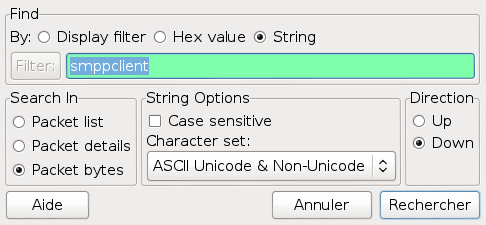
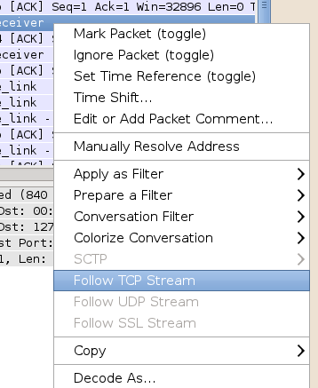
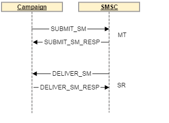
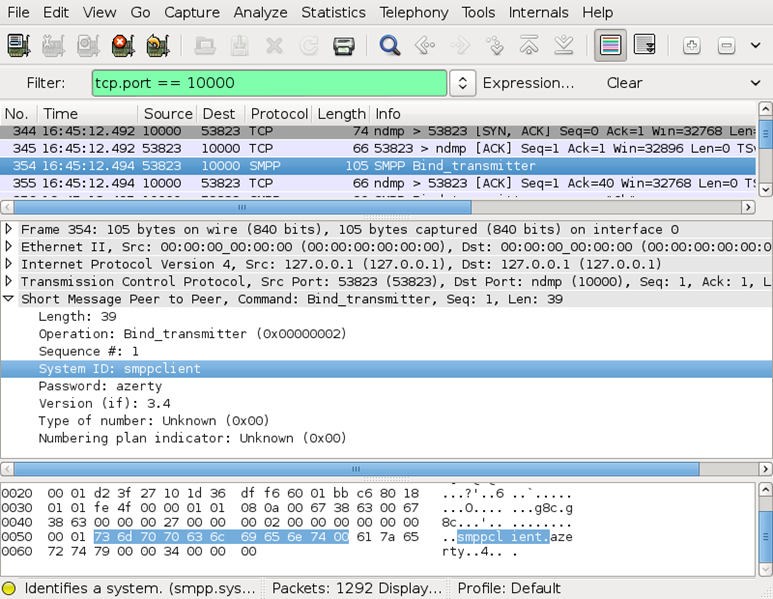
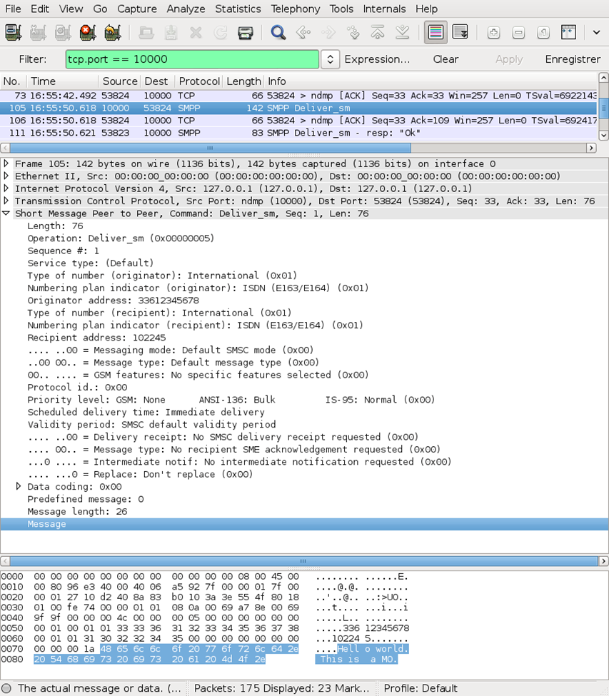
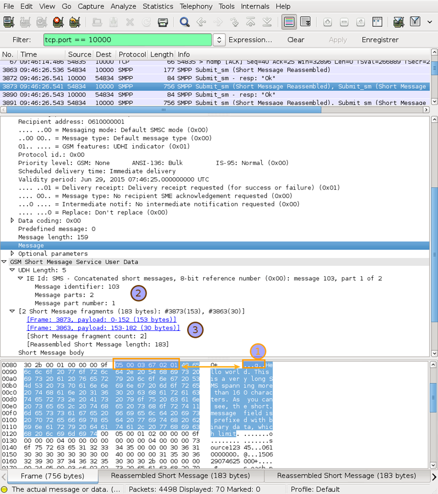
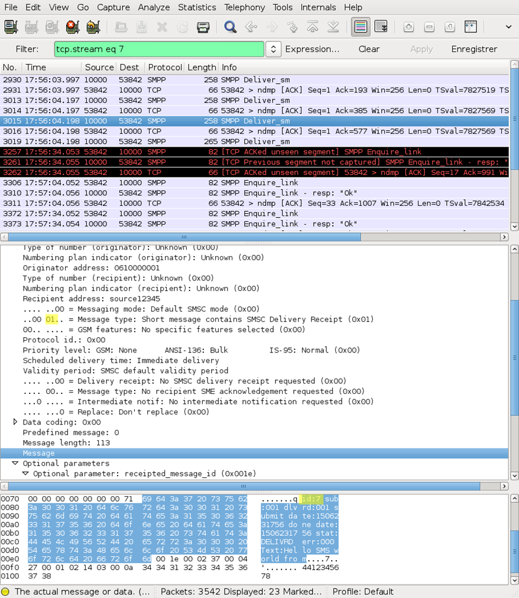
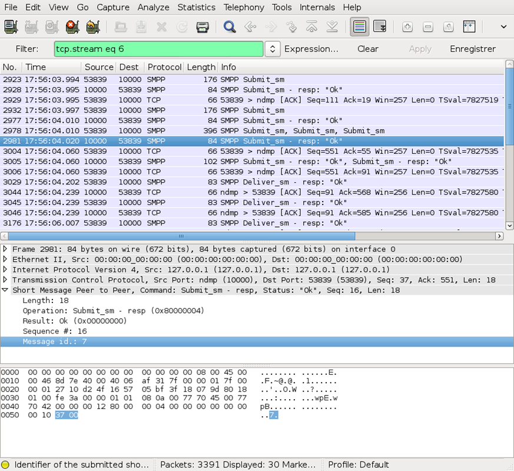
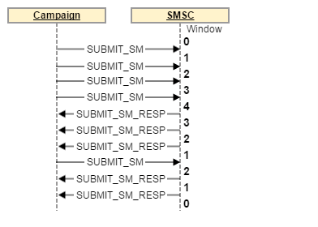

# SMPP-protokollanalys med Wireshark


I den här artikeln visas hur du utför SMPP-protokollanalys med Wireshark för Adobe Campaign Classic.

## Beskrivning {#description}


<b>Miljö</b>

Adobe Campaign Classic (ACC)

<b>Problem/symtom</b>

Lär dig hur du analyserar SMPP-trafik med Wireshark.

De flesta SMS-C (Short Message Service Centers) med hög genomströmning är kompatibla med SMPP-protokollversion 3.4. Detta protokoll tillåter att SMS skickas och att information om leveransen av dessa SMS tas emot. SMPP-protokollet beskrivs i SMPP-protokollspecifikationen v3.4 som finns på Internet som ett PDF-dokument.

Den här artikeln ersätter inte den här specifikationen: den innehåller praktiska tips om hur du tolkar protokollspecifikationen och matchar den med Wireshark-skärmen för att felsöka problem mellan Adobe Campaign och SMS-C-partnern.

Eftersom SMPP-protokollet innehåller många delar som återstår för implementeringsteamets tolkning finns det skillnader mellan olika SMS-C.

Vid felsökning ska du alltid kontakta SMS-C-partnern för att få information eller för att hjälpa dig att dubbelkontrollera vad du får. Om SMS-C-svaret innehåller ett fel är din SMS-C-partner den bästa personen att tala om för dig varför den svarade på felet. Om du använder en SMPP-simulator i stället för att ansluta till en riktig SMS-C bör du använda källkoden (eller en felsökare) för att förstå vad som händer.


## Upplösning {#resolution}


<b>Hämta nätverkstrafik utan Wireshark</b>

Om du inte har direktåtkomst till datorn kan det vara nödvändigt att hämta med kommandoradsverktyg som tcpdump. Om du redan känner till TCP-porten för anslutningen kan du lägga in rätt filter så att du inte fångar all trafik. Här följer ett exempel på en kommandorad för tcpdump för att hämta port 12345 till <b>outfile.pcap</b>:


```
tcpdump -i any -w outfile.pcap tcp port 12345
```


Filen <b>outfile.pcap</b> kan sedan öppnas i Wireshark för ytterligare analys.

I det här avsnittet förutsätts att du känner till grunderna i Wireshark: hämta paket, definiera enkla filter, läsa paketinformation. En kort introduktion finns på [Hur man använder Wireshark för att hämta, filtrera och använda Inspect-paket](https://www.howtogeek.com/104278/how-to-use-wireshark-to-capture-filter-and-inspect-packets/).

Det finns tre viktiga funktioner för att filtrera bort SMPP-trafik i Wireshark:

- Använd ett visningsfilter på porten för SMS-C. Om SMS-C till exempel använder port 10000 använder du följande filter:
  `tcp.port == 10000`


- Om du vill isolera paket per telefonnummer eller textinnehåll använder du sökfunktionen med följande inställningar:    


- Använd <b>Följ TCP-strömmen</b> för att isolera den ström du arbetar med.
Stäng det röda/blå textfönstret som visas eftersom det bara är användbart för textprotokoll som inte är relevanta för SMPP.


- 


### <b>SMPPProtocol</b>

Protokollet fungerar över TCP och är helt binärt, vilket innebär att specialverktyg som Wireshark (eller en hexadecimal redigerare) krävs för att dekryptera innehållet i strömmen.

Direktuppspelningen består av oberoende PDU:er: varje PDU:er är ett meddelande som innehåller ett kommando, en status, ett sekvensnummer och annan information som baseras på kommandot.

På grund av TCP-filens natur som ett direktuppspelningsprotokoll kan ett TCP-paket innehålla mer än en PDU, och PDU:er kan sträcka sig över 2 eller fler TCP-paket. Wireshark sätter ihop PDU:er på nytt på rätt sätt, så det är till största delen genomskinligt för Wirehak-användaren.

Här följer ett exempel på PDU:er som skickas via nätverket när en MT skickas och sedan får en SR:



Obs! En lista över standardkommandon finns i avsnitt 5.1.2.1 i SMPP-specifikationen (SMPP Command set).

### <b>SMPP-svar</b>

SMPP-protokollet kräver att alla kommandon bekräftas av en PDU för svar:

BIND_TRANSMITTER bekräftas av *BIND_TRANSMITTER_RESP*, *SUBMIT_SM* bekräftas av *SUBMIT_SM_RESP*, osv.

Det finns en timeout för svar, vanligtvis 10, 30 eller 60 sekunder. Svaret kan innehålla en positiv bekräftelse (command_status = 0) eller ett fel (se 5.1.3 *command_status*, *tabell 5-2* i SMPP-specifikationen för listan över standardfel). Vanligtvis är dessa svar omedelbara och ingen tidsgräns för svar nås.

Se till att skilja mellan SMPP-svarsfel och SR-felkoder: samma felkod kan betyda olika saker i svarsfelet eller i SR-felfältet. När du rapporterar en felkod måste du vara mycket noggrann med var du hittade den, eftersom värdets betydelse beror på dess sammanhang.

### <b>Initiering av SMPP-anslutning</b>

SMPP-anslutningen börjar med att ansluta med TCP. Sedan skickas en BIND-åtgärd av en kampanj som bekräftas av en BIND RESP. Dessa åtgärder beskrivs i avsnitt 4.1 i SMPP-specifikationen (BIND-operation).
<br><br>


Bindningen utför inloggnings-/lösenordskontrollen och utbyter information om plattformsnamnet, versionen och andra fält som beskrivs i specifikationen.


Obs! Inloggningen finns i fältet system_id.


I Campaign bör du se en *BIND_TRANSMITTER* paket när en MT-överföring initieras och *BIND_RECEIVER* paket när *nlsm* utlöser en MO/SR-anslutning.

<b>Sändare, mottagare och sändare: </b>SMPP-kopplingen för Campaign Classic fungerar i ett separat överföringsläge/mottagarläge: det finns två TCP-anslutningar, en för överföring av MT och en annan för mottagande MO och SR. Observera att TCP-anslutningen alltid initieras av Campaign, även för mottagarläget.

SMPP tillhandahåller också ett sändningsläge, men det här läget implementeras inte i SMPP-anslutningen för Campaign Classic.

SMPP-anslutningen använder flera anslutningar parallellt för att överföra MT. Detta kan inte styras på grund av hur anslutningen är utformad.
<b>Tar emot MO</b>
När mottagaren är bunden kan SMS-C skicka MO när som helst. Flerlägesobjektet skickas med en *DELIVER_SM* PDU med bitarna 2-5 av *esm_clas* klart (ofta, *esm_class* blir bara 0).


<br><br>
The *DELIVER_SM* PDU:n måste snabbt besvaras av en *DELIVER_SM_RESP* PDU med samma *sekvensnummer*.
<b>Skicka MT</b>
För att skicka en MT måste sändaren bindas. Kontrollera att bindningsprocessen har utförts.

MT skickas i en *SUBMIT_SM* PDU. SMS-C bör snabbt svara med en *SUBMIT_SM_RESP* PDU: det här svarspaketet är särskilt eftersom det innehåller ID:t för meddelandet i SMS-C-databasen (inkludera alltid detta ID när du pratar med SMS-C-partnern för att hjälpa honom att hitta meddelandet snabbare). Detta ID finns i SR och är det enda sättet att matcha MT med motsvarande SR.

Fältet *registered_delivery* (som beskrivs i avsnitt 5.2.17 i specifikationen) anger för SMS-C om en SR begärs för denna särskilda MT. Om du inte får SR för ett visst meddelande kontrollerar du att fältet är korrekt inställt i *SUBMIT_SM* PDU.


<b>Kodning av MT</b>
Varning! SMS-kodning är ett komplext ämne med många svällningar och olika implementeringar.


Bra rutiner är alltid att kontakta SMS-C-partnern om det uppstår kodningsproblem. Din SMS-partner har en detaljerad kunskap om den kodning och de särskilda regler som stöds som kan gälla på grund av begränsningar i deras tekniska plattform. Få dem att kontrollera vad du skickar till dem och vad de skickar tillbaka till dig. Det är den enda vägen till en framgångsrik och stabil sammankoppling.

SMS-meddelanden använder en speciell 7-bitars kodning, som ofta kallas GSM7-kodning. Se Wikipedia GSM 03.38 (på engelska).

I SMPP-protokollet kommer GSM7-text att utökas till 8 bitar per tecken för enklare felsökning. SMS-C paketerar det i 7 bitar per tecken innan det skickas till mobilen. Det innebär att SMS-meddelandefältet short_message kan vara upp till 160 byte långt i SMPP-bildrutan, medan det är begränsat till 140 byte när det skickas via mobilnätet (den viktigaste biten ignoreras helt enkelt).

I händelse av kodningsproblem finns det några viktiga saker att kontrollera:

- Kontrollera först att du vet vilka tecken som tillhör vilken kodning. GSM7 är känt för sitt partiella stöd för diakritiska tecken (accenter). Särskilt på franska, där é och è är en del av GSM7, men ê, â eller ï inte är det. Situationen är inte bättre när det gäller spanska.
- C med cedilla (ç) förekommer endast i versaler i GSM7-alfabetet, men vissa telefoner återger det i gemener eller i&quot;smart&quot; fall: den allmänna rekommendationen är att helt undvika det och ta bort cedillan (den är fortfarande mycket läsbar på franska) eller växla till UCS-2.
- Använd inte ASCII i SMS om du inte uttryckligen har begärt det av SMS-C-partnern: den här kodningen tar bort utrymme eftersom den har 8-bitars tecken och har mindre täckning än GSM7.
- Latin-1 stöds inte alltid: kontrollera kompatibiliteten med din SMS-C-partner innan du försöker använda Latin-1.
- Tabeller för nationella språkskift stöds inte av Adobe Campaign Classic-kopplingen. Du måste använda UCS-2 istället.
- UCS-2 och UTF-16 blandas ofta med telefoner. Detta är ett problem för personer som skickar känslolägesikoner och andra sällan använda tecken som inte finns i UCS-2.
- GSM7-kodningen stöds inte av Wireshark: specialtecken visas felaktigt. Om du behöver kontrollera om en GSM7-sträng är rätt kodad måste du jämföra hexadecimala koder med GSM7-tabellen.


The *data_coding* -fältet anger vilken kodning som används. Det enda problemet är att värdet 0 betyder standardkodning för SMS-C i specifikationen, men i allmänhet betyder det GSM7. Kontrollera med SMS-C *partner vilken kodning som är associerad med data_coding = 0 (Adobe Campaign stöder endast GSM7 för data_coding* = 0).

Den största tillåtna storleken för ett meddelande beror på dess kodning. I denna tabell sammanfattas all relevant information:


| Kodning | data_coding | Meddelandestorlek (tecken)  | Delstorlek för multipart-SMS  | Tillgängliga tecken  |
| --- | --- | --- | --- | --- |
| GSM7 | 0 | 160 | 152 | [Grundläggande GSM7-teckenuppsättning + tillägg](https://en.wikipedia.org/wiki/GSM_03.38) (utökade tecken tar 2 tecken)  |
| Latin-1  | 3 | 140 | 134 | ISO-8859-1 |
| UCS-2 UTF-16  | 8 | 70 | 67 | Unicode (varierar från telefon till telefon) |

<b>Användardatarubrik (UDH)</b>
UDH (User Data Header) är små binära rubriker som läggs till i texten i ett SMS. De kan utlösa specialfunktioner som SMS-sammanfogning, tabeller för nationella språkskift, logotyper/bilder (används sällan) eller WAP push.

Eftersom UDH är en del av textfältet (SMPP-fältet short_message) förkortas den effektiva storleken för ett SMS. En sammanfogad SMS UDH använder till exempel 6 byte per SMS-del (som är 6 riktiga 8-bitars byte, inte 7-bitars tecken), vilket ger plats för endast 152 7-bitars tecken per meddelandedel.

Wikipedia har bra artiklar om User Data Header och Concatenated SMS (på engelska).

Om du vill veta om ett short_message innehåller en UDH-fil ska du kontrollera bitarna 6 och 7 i esm_class (se avsnitt 5.2.12 i specifikationen). Wireshark tolkar UDH i gränssnittet och ger korrekt information.
<br><br>
På skärmbilden ovan kan du se rubriken för användardata i meddelandefältet (1), informationen i UDH (2) och viss extra information som inte hör till paketet, men som beräknas av Wireshark (3): textfältet för kort meddelande är särskilt intressant eftersom det innehåller hela meddelandet som har återskapats av Wirehak.
<b>Mottagande SR</b>
När mottagaren är bunden kan SMS-C skicka SR när som helst. SR skickas med PDU:n DELIVER_SM med bitarna 2-5 av *esm_class* set.




The *DELIVER_SM* PDU:n måste snabbt besvaras av en *DELIVER_SM_RESP* PDU med samma *sekvensnummer*. Sök efter en *SUBMIT_SM_RESP* med samma ID. Detta är t.ex. MT som matchar SR:




SR skickas endast om *registered_delivery* -fältet anges i MT.

Obs! Adobe Campaign Classic SMPP Connector hanterar inte SR som kommer före *SUBMIT_SM_RESP* paket. Specifikationen förbjuder inte uttryckligen detta beteende, men det anses som dåligt beteende (det skulle innebära att meddelandet har tagits emot innan det har skickats). Om du råkar ut för det här fallet för ofta ber du din SMS-C-partner att åtgärda den här plattformen.
<b>Bestämma fältet short_message i SR</b>
Textfältet i SR PDU:er har en särskild kodning som beskrivs i tillägg B till SMPP-protokollspecifikationen. Tyvärr är detta format bara en rekommendation utan att vara en del av protokollet, även om de flesta SMS-C respekterar mer eller mindre detta format.

Du bör fråga SMS-C-partnern direkt om du vill ha en dokumentation om hur implementeringen fungerar och dubbelkontrollera att den matchar vad du ser i Wirehak. Oftast vet inte ens implementeringen av SMS-C:er, vilket leder till problem och missförstånd. Tveka inte att be SMS-C-partnern om hjälp om det finns några tvivel om detta fält (särskilt felkoderna).

Grundformatet är följande:


```
id:IIIIIIIIII sub:SSS dlvrd:DDD submit date:YYMMDDhhmm done date:YYMMDDhhmm stat:DDDDDDD err:EEE

Text:........
```


Det här är allmänna riktlinjer för läsning av raden ovan:

- ID:t är det som har skickats i *SUBMIT_SM_RESP* av matchande MT.
- Du kan ignorera problem i textfältet: det här fältet ignoreras av Campaign eftersom det är oanvändbart, otillförlitligt och till och med kan vara helt oläsligt om SMS skickades med en annan kodning än ren alfanumerisk ASCII. Detta är normalt beteende.
- Fältnamn är inte skiftlägeskänsliga (t.ex. id: sub: Text: kan också anges som ID: SUB: text:).
- The *dlvrd* fältet är vanligtvis inte tillförlitligt, såvida det inte dokumenteras av SMS-C-partnern.
- Datumen kan ha vilken tidszon som helst, vilket gör dem praktiskt taget oanvändbara eller så är de helt fel eftersom fjärrserverns klocka är avstängd.
- The *stat* fält kan ha andra värden än de som definieras i tillägg B. Använd sunt förnuft och SMSC-partnerns dokumentation för att förstå dess betydelse.
- The *err* fältet är helt beroende av SMS-C och merparten av tiden som dokumenteras av SMS-C-partnern. Koden 000 innebär ofta en framgång, medan annan kod anger fel. Fältet är ofta numeriskt men kan också vara hexadecimalt.

<b>Flera SR för samma MT</b>
Vissa SMS-C skickar flera SR för samma MT för att spåra utvecklingen i nätverket. Detta är oftast oanvändbart eftersom klienten oftast bara vill veta när meddelandet togs emot (det här är vanligtvis sista SR).

Om du är osäker kan du bara arbeta med den senaste SR som tagits emot från SMS-C för att hitta meddelandets status.
<b>SMPP-fönster</b>
Eftersom åtgärder och svar är asynkrona kan du optimera överföringshastigheter genom att skicka flera PDU:er för åtgärder innan du väntar på svar. Antalet meddelanden som inte har något svar kallas fönstret.

Exempel på en överföring med ett maximalt fönster på 4:



Den aktuella implementeringen styr inte fönstret och förväntar sig att SMS-C:n på fjärrbasis är snabb nog att hantera MT.
