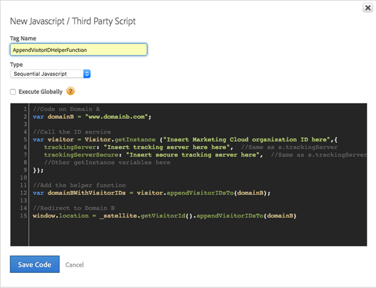

# Så här ställer du in hjälpfunktionen för tjänsten Marketing Cloud ID i Adobe Dynamic Tag Manager


Det här är en detaljerad guide för att ställa in hjälpfunktionen för Marketing Cloud ID-tjänsten i Adobe Dynamic Tag Manager.

## Beskrivning {#description}


### <b>Miljö</b>

Adobe Experience Cloud

### <b>Problem/symtom</b>

I den här artikeln beskrivs hur du implementerar Adobe Marketing Cloud ID Service [Lägg till besökar-ID-funktion](https://experienceleague.adobe.com/docs/id-service/using/id-service-api/methods/appendvisitorid.html) i Adobe Dynamic Tag Management (DTM).

<b>Obs!</b> Läs in Marketing Cloud ID Service VisitorAPI.js 1.8.0 eller senare i [DTM Marketing Cloud ID-tjänst](https://experienceleague.adobe.com/docs/id-service/using/id-service-api/methods/getmcvid.html) på både ursprungs- och måldomäner. Testning bör utföras i webbläsarsituationer där cookies blockeras för att validera funktionen.


## Upplösning {#resolution}


### <b>Inställningar - domän A</b>

Ange måldomänen (domän B) i en sekventiell regel för sidinläsning med en anpassad JavaScript från tredje part i domän A.

Se skärmbilderna nedan som ett exempel:





```clike
//Code on Domain A
var domainB = "www.domainb.com";
 
//Call the ID service
var visitor = Visitor.getInstance ("Insert Marketing Cloud organization ID here",{
trackingServer:"Insert tracking server here here", //Same as s.trackingServer
trackingServerSecure: "Insert secure tracking server here", //Same as s.trackingServerSecure
...
//Other getInstance variables here
...
});
 
//Add the helper function
var domainBWithVisitorIDs = visitor.appendVisitorIDsTo(domainB);
 
//Redirect to Domain B
window.location = _satellite.getVisitorId().appendVisitorIDsTo(domainB)
```


<b>Obs!</b> Om du vill omdirigera till en mer explicit sökväg måste domäninställningen återspegla den avsikten. Om omdirigeringarna kräver en mer dynamisk konstruktion kan den anpassade koden läggas till i ett dataelement eller en regel för direktanrop. Till exempel: `var domainB = "http://www.domainb.com/products/"`

### <b>Verifiera - domän B</b>

Gå från domän A till domän B. Kontrollera att MID i domän B matchar MID i domän A genom att anropa följande i utvecklarkonsolen:  `_satellite.getVisitorId().getMarketingCloudVisitorID()().appendVisitorIDsTo(domainB)`
