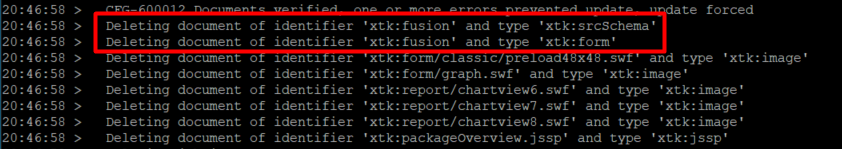

# Hämtning av XML-110011 Det gick inte att hitta &#39;fusion&#39;-elementet

## Beskrivning {#description}

<b>Miljö</b>
Campaign Classic V7

<b>Problem/symtom</b>
<b>För lokala användare</b>

När du har uppgraderat en Campaign-instans till ACC-21.1 build 9342 eller senare och försöker installera ett Campaign-paket inträffar följande fel:

   

## Upplösning {#resolution}

Sammanfusionsschemat (`xtk:fusion`) ska tas bort under efteruppgraderingen. Men i vissa fall finns schemat fortfarande kvar.

När du frågar efter databasen kan du se följande poster:

Om du vill ta bort xtk:fusion-schemat måste du köra efteruppgraderingsverktyget med alternativet&quot;-force&quot;:

`nlserver config -postupgrade -allinstances -force`

Du bör se följande:

Om schemat fortfarande finns kan du försöka med `"-force -repair"` alternativ:

`nlserver config -postupgrade -allinstances -force -repair`

Om det fortfarande inte fungerar kan du behöva ta bort posterna från databasen manuellt.
