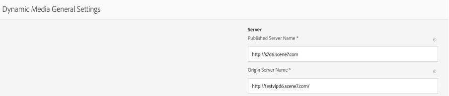

# Ändra Dynamic Media URL för DM [!DNL Assets] (AEM 6.5.11 och senare)

## Beskrivning

På din AEM Author Instance (version 6.5.11 och senare) kan du använda [!UICONTROL General Settings] för att konfigurera DM-serverinställningar och ändra [!UICONTROL Publish Server URL] eller [!UICONTROL Dynamic Media URL] för dina DM-resurser.

Öppna [!UICONTROL Dynamic Media General Settings] på din AEM Author Instance, klicka på <b>[!UICONTROL Tools] - [!UICONTROL Assets] - [!UICONTROL Dynamic Media General Setting]</b>:

Kontrollera att du har konfigurerat Dynamic Media på din AEM Author Instance, klicka på [!UICONTROL Tools] - [!UICONTROL Cloud Services] - [!UICONTROL Dynamic Media Configuration].

Publicerat servernamn är en CDN-server (Content Deliver Network) som används i alla systemgenererade URL-anrop som är specifika för ditt Dynamic Media-konto.

Se till att ditt anpassade domännamn antingen är mappat till Adobe CDN Server eller, om du använder din egen CDN-leverantörs domännamn, bör det mappas till vår [!UICONTROL Origin Server Name \*]

\*Kontakta Adobe Dynamic Media support för mer information.

## Upplösning

Spara ändringarna när du har ändrat det publicerade servernamnet. Ändra inte <b>Namn på ursprunglig server</b> om inte en supporttekniker från Adobe Dynamic Media ger anvisningar om detta.

Instruktioner om hur du ändrar namn på publicerad server för befintliga Dynamic Media-komponenter på webbplatssidorna:

- Installera [bifogat paket](assets/ka-17628_update-publishserverurl-sites-1.0.zip), för att skapa en URL-nod för Publish Server
- När paketet har installerats kommer du att märka att 2 filer har skapats på din AEM-författare

   - [/libs/dam/gui/content/s7dam/updatepublishserverurl](http://vgaur-wx-1:4502/crx/de/index.jsp#/crx.default/jcr%3aroot/libs/dam/gui/content/s7dam/updatepublishserverurl "Visa sökväg i CRXDE Lite")
   - [/libs/dam/gui/components/s7dam/updatepublishserverurl/updatepublishserverurl.js](http://vgaur-wx-1:4502/crx/de/index.jsp#/crx.default/jcr%3aroot/libs/dam/gui/components/s7dam/updatepublishserverurl/updatepublishserverurl.jsp "Visa sökväg i CRXDE Lite")p

.

- Ange din AEM Sites-sökväg på parametern &quot;path&quot; på den här URL:en: http://aem-server:portnumber/libs/dam/gui/content/s7dam/updatepublishserverurl.html?path=/content/mysite&amp;update=true
- Om du skickar den URL:en uppdateras DM-URL:erna automatiskt för alla Dynamic Media-komponenter på alla Sites-sidor på den angivna AEM Sites-sökvägen och den här typen av utdata visas:

Alla Dynamic Media-komponent-URL:er kommer att ändras till det nya publicerade servernamnet för din AEM webbplats.

Detta är en vy av DM-komponenten med det gamla publicerade servernamnet

Det här är en vy av DM-komponenten. Namnet på den publicerade servern ändras efter att du klickat på den här URL:en: http://aem-server:portnumber/libs/dam/gui/content/s7dam/updatepublishserverurl.html?path=/content/mysite&amp;update=true

Obs! Om du vill visa en lista över alla Dynamic Media-komponenter i din AEM Sites-sökväg kan du ringa den här URL:en: http://aem-server:portnumber/libs/dam/gui/content/s7dam/updatepublishserverurl.html?path=/content/mysite
