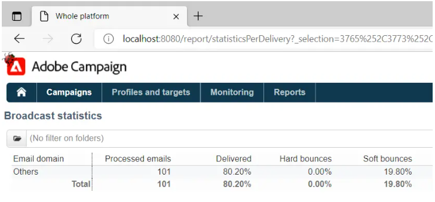

# Leveransrapporter kan inte samla statistik i ACC på grund av IE-begränsning


Lär dig hur du löser ett problem med Campaign Classic där URL-längden i Internet Explorer (IE) är 2 048 tecken. Lös detta genom att kopiera URL:en till rapporten från Adobe Campaign Classic (ACC).

## Beskrivning {#description}


### Miljö

Adobe Campaign Classic

### Problem/symtom

Problemet är relaterat till den maximala URL-längden i Internet Explorer, som är 2 048 tecken: [information](https://support.microsoft.com/en-us/topic/maximum-url-length-is-2-083-characters-in-internet-explorer-174e7c8a-6666-f4e0-6fd6-908b53c12246).

Sidans HTML-källa visar rapporter i ACC-användarkonsolen.

URL:erna i `href` attributen för `<` a`>`  är bra, d.v.s. de är inte trunkerade. Om en URL-adress kopieras och klistras in i IE kommer länken att trunkeras till 2 048 tecken och du kommer inte att kunna öppna den:


Samma sak händer när du högerklickar på rapporten i användarkonsolen och väljer *Öppna i nytt fönster*. IE öppnas automatiskt, men adressfältet är tomt. Om färre leveranser väljs och stegen upprepas, öppnas IE med rätt URL.

För närvarande görs en pågående insats för att ersätta IE med Edge. Edge baseras på Chromium och har inte dessa URL-begränsningar. Detta har bekräftats genom att den långa URL:en kopieras/klistras in i Edge, som inte kortar av URL:en och öppnar rapporten utan några problem:




## Upplösning {#resolution}


Problemet bör lösas automatiskt när övergången från IE till Edge är klar. Till dess kan följande lösning distribueras:

- Kopiera URL:en till rapporten från ACC-klientkonsolen genom att högerklicka på rapporten och välja *kortkommandot Kopiera*. Då kopieras hela URL:en till Urklipp.
- URL-adressen måste ändras något för att kunna öppnas i andra webbläsare. Den kopierade URL:en kommer att följa detta mönster:


  ```
  javascript:switchToReportView(%22statisticsPerDelivery%22,%20%22/report/statisticsPerDelivery?_selection=3765%252C37...
  ```


- Den del av URL:en som börjar från `/report/` måste kopieras och läggas till i instansens adress. I det här fallet är adressen *localhost*:


  ```
  http://localhost:8080/report/statisticsPerDelivery?_selection=3765%252C3773%252C3781%252C3789%252C3793%252C3769%...
  ```


- Kopiera den resulterande URL:en till en annan webbläsare (Edge, Firefox eller Chrome fungerar bra).

