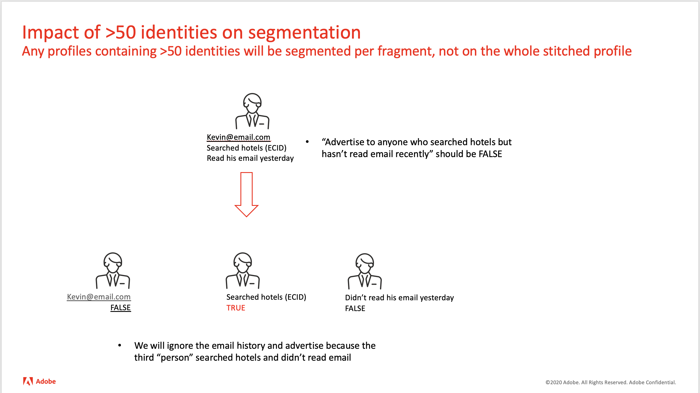

# Kvalificering av profiler i segment med fler än 50 identiteter

## Beskrivning


Fråga: Kan profiler med fler än 50 identiteter kvalificera sig för segment?

Miljö - Adobe Experience Platform





## Upplösning


När segment definieras för att använda privat diagram är den normala processen att fråga efter profilfragment med alla ID:n i identitetsdiagrammet, och resultaten samlas i en enda profil som kombinerar profilposter och händelseposter. Men när ett identitetsdiagram har fler än 50 enheter sammanfogas inte profilfragmenten till en profil. I stället behandlas varje profilfragment som en hel profil, och segmentutvärderingen utförs mot varje fragment individuellt. Ett segment som definierats så att det omfattar personer bosatta i Kalifornien utvärderas till true för profilfragmentet som innehåller attributet state, men de andra profilerna och händelsefragmenten utvärderas till false. På samma sätt utvärderas ett segment som är definierat för att inkludera webbsidesbläddring till true för [!DNL Analytics] rapporterar fragment av programsviten, men profilfragmenten och andra händelsefragment utvärderas till false. Risken är när segmentet innehåller ett negativt villkor, t.ex. &quot;inget e-postmeddelande har skickats den senaste veckan&quot;. E-posthändelsen kommer inte att vara knuten till någon profil eller andra händelseposter, så utvärderingen av profilen och andra händelser kan generera ett falskt positivt resultat.


För att förhindra att fragment utvärderas till true är det en metod att inkludera ett villkor för både ett profilattribut OCH en händelse, t.ex. &quot;... där customer_id finns och det finns minst en händelse&quot;. Inget fragment kommer att ha båda villkoren, så inget fragment utvärderas som sant. Vanligtvis är det möjligt att lägga till befintliga tester för både profiler och händelser utan att ändra segmenteringsresultaten, t.ex. testning för ett CRM-ID när kända kunder segmenteras.

Så här avgör du om ett identitetsdiagram har fler än 50 poster för identitetsanvändning [!DNL Postman] för att anropa UPS via API:t med det ID som visas nedan.   Svaret innehåller det angivna felet om maximalt 50 har överskridits.

[!DNL Postman] API-konfiguration


```
GET /data/core/ups/access/entities?entityId=KRN1136260447&entityIdNS=custid&schema.name=_xdm.context.profile HTTP/1.1
Host: platform.adobe.io
Content-Type: application/json
Authorization: Bearer 
x-gw-ims-org-id: <b></b><b></b>*
x-api-key: acp_onboarding
```

<br><br>Svar:<br><br>

```
{
    "message": "Received too many related identities. Received: 85, Maximum: 50.",
    "statusCode": 422,
    "type": "http://ns.adobe.com/aep/errors/UPSDK-112004-422",
    "title": "Too many related identities.",
    "error-code": "UPSDK-112004-422",
    "error-message": "Received too many related identities. Received: 85, Maximum: 50.",
    "status": 422
}
```
