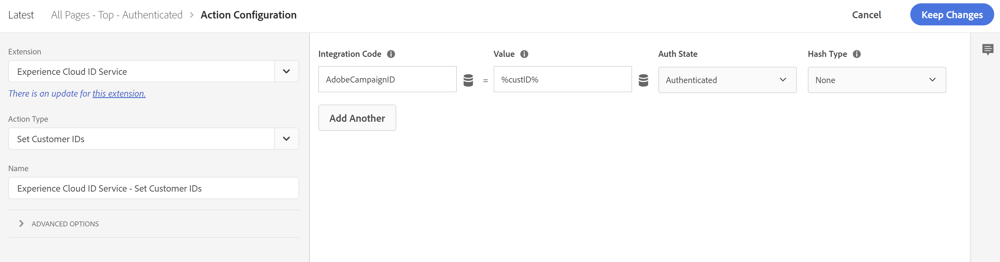

# Experience Cloud/målgruppsbibliotek/AAM målgrupper och segment saknar volym eller storlek i Adobe Campaign

## Beskrivning {#description}

PROBLEM/SYMTOM:
<br>Även om allt verkar vara korrekt konfigurerat har upplevelsen av Cloud/Audience Library/AAM målgrupper och segment ingen volym eller storlek i Adobe Campaign
<br> 
<br>MILJÖKONFIGURATION:<br>
- Campaign Classic eller Standard
- AAM och/eller målgruppsbibliotek
- Kampanjen har konfigurerats [Standard](https://experienceleague.adobe.com/docs/campaign-standard/using/integrating-with-adobe-cloud/working-with-campaign-and-audience-manager-or-people-core-service/provisioning-and-configuring-integration-with-audience-manager-or-people-core-service.html?lang=en) eller [Klassisk](https://experienceleague.adobe.com/docs/campaign-classic/using/integrating-with-adobe-experience-cloud/audience-sharing/configuring-shared-audiences-integration-in-adobe-campaign.html?lang=en) för att använda Experience Cloud-målgrupper (tjänsten People Core, Audience Library eller AAM)
- Om Campaign Classic: Användare kan logga in på Campaign Classic via Adobe IMS
- AAM segment eller målgruppsbibliotek har konfigurerats att skicka till Campaign med hjälp av datakällan för deklarerat ID i Campaign-gränssnittet.


## Upplösning {#resolution}


ROT ORSAKAR: Ett av de främsta syftena med Campaign är att skicka meddelanden (e-post, SMS, osv.) för kända individer måste AAM (målgruppsbibliotek) ha samma ID som Campaign använder för kundidentifiering som lagras i sin (AAM) egen deklarerade ID-datakälla. För den här integreringen skickar AAM (Audience Library) bara listan med kund-ID:n för de kunderna i det valda segmentet/den valda målgruppen till Campaign så att Campaign kan identifiera och skapa en lista med samma personer. Om AAM inte har de ID:n som ska skickas skickas inga målgrupper från AAM (Audience Library) till Campaign. 
 
STEG SOM SKA LÖSAS: Så här lagrar du det kund-ID som behövs i AAM deklarerade ID-datakälla:

1. Se till att det kund-ID som behövs kan visas på sidan när slutanvändaren autentiserar.
2. När slutanvändaren autentiserar synkroniserar du kundens identifierare med AAM deklarerad ID-datakälla via [setCustomerID-funktionen för Experience Cloud ID-tjänsten](https://experienceleague.adobe.com/docs/id-service/using/id-service-api/methods/setcustomerids.html?lang=en) (eller använd Experience Cloud ID-tjänsten - Ange åtgärd för kundens ID i datainsamlingen) med integreringskoden/aliaset: AdobeCampaignID. Exempel:


```
Visitor.setCustomerIDs({
         "AdobeCampaignID":{ 
             "id":"YOUR CUSTOMER ID", 
             "authState":Visitor.AuthState.AUTHENTICATED 
        } 
 });
```


eller i datainsamling:

 
Där %custID% representerar ett dataelement där det kund-ID som behövs lagras

1. Validera att ID:t skickas till AAM genom att leta efter parametern d_cid_ic i det demdex.net-nätverksanrop som skickas när funktionen setCustomerID anropas. Du bör se integreringskoden för AdobeCampaignID, kund-ID:t och värdet 1 (vilket betyder autentiserad) avgränsat med ett icke-utskrivbart tecken.


1. Vänta i några dagar innan kund-ID:n samlas in i AAM och övervaka målgruppens storlek i Campaign.

