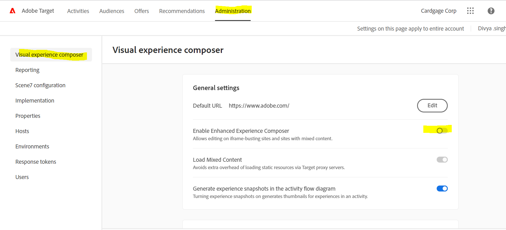

# VEC-målfelsökning/-felsökning

## Beskrivning

 1. Det gick inte att läsa in sidans URL i Adobe target VEC.      Här är några exempel på fel -   a)      b)       c)   

## Upplösning

1. Försök att rensa cookies och cacher eller öppna webbplatsen i inkognito-läge. 
2. Prova en annan webbläsare, som Mozilla Firefox, Microsoft Edge 3. I sådana fall installerar du VEC-hjälpredwebbläsartillägget a) Installera tillägget från [https://chrome.google.com/webstore/detail/adobe-target-vec-helper/ggjpideecfnbipkacplkhhaflkdjagak](https://chrome.google.com/webstore/detail/adobe-target-vec-helper/ggjpideecfnbipkacplkhhaflkdjagak)
b) Om du vill använda tillägget klickar du på ikonen för VEC Helper-webbläsartillägget ( ) i webbläsarens verktygsfält när du är i VEC. 
c) Aktivera &quot;<b>mata in målbibliotek</b>&quot; och &quot;cookies&quot; växlar till &quot;on&quot;.

d) Popup-fönster där du uppmanas att tillåta att tillägget lägger till målbibliotek på sidan för att aktivera redigeringen, som du måste tillåta.
e) Tillåt osäkert innehåll från platsinställningarna ([https://experienceleague.adobe.com/docs/target/using/experiences/vec/troubleshoot-composer/mixed-content.html?lang=en](https://experienceleague.adobe.com/docs/target/using/experiences/vec/troubleshoot-composer/mixed-content.html?lang=en))

- Klicka på låsikonen (försiktighet) och klicka sedan på platsinställningarna.
- Bläddra till osäkert innehåll och använd sedan listrutan för att ändra &quot;Blockera (standard)&quot; till &quot;Tillåt&quot;.
- Läs in VEC-sidan igen.

f) Ange EEC (Enhanced Experience Composer) som inaktiverat i följande steg

- Gå till Target-Administration-VEC - Växla från EEG

Obs!- Om problemet kvarstår öppnar du webbläsarens utvecklarkonsol och söker efter ett felmeddelande där.
3. Målet stöds inte om webbplatsen innehåller iframes på flera nivåer. 

<b>Åtkomst till efterinloggningssidor i VEC</b>
1. Läs in sidan i VEC och klicka på fliken &quot;webbläsare&quot;, ange dina uppgifter och gå sedan till önskad sida. 
2. Klicka på fliken Disponera och gör ändringarna i VEC. 
ELLER
1. Öppna en webbplats på en ny flik och ange dina inloggningsuppgifter.
2. Öppna VEC i målet och läs in sidan direkt efter inloggning. 
3. Nu läses sidan in i VEC för att utföra ändringen.
