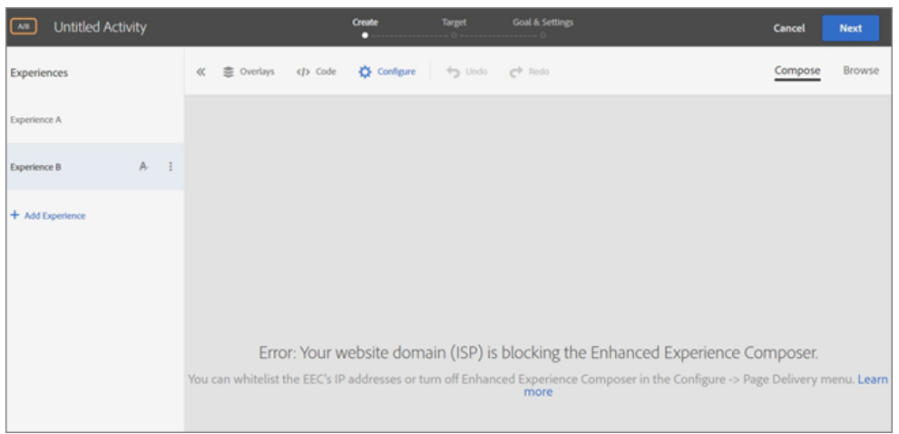

# Adobe Target EEC - felsökning

Detaljerad guide om Adobe Target EEC-felsökning genom att tillåtslista IP-adresserna som listas nedan. (Kontakta IT-avdelningen för att tillåtslista följande IP-adresser)

## Beskrivning {#description}

<b>Miljö</b>
Adobe Target

### Problem/symtom

<b>Vanliga EEG-relaterade frågor</b>
1. EEC läser inte in en intern QA-URL som inte är tillgänglig på offentlig IP.
2. Visa timeout eller &quot;*åtkomst nekad*&quot; fel vid inläsning av webbplatser med proxy aktiverat. (endast EEG)
3. Webbplatsdomän som blockerar EEG.

## Upplösning {#resolution}

<b>Problem: </b>Din webbplatsdomän (ISP) blockerar Förbättrad Experience Composer.

<b>Lösning:</b> Tillåtslista IP-adresserna som listas nedan (be IT-teamet att tillåtslista följande IP-adresser):

- 99.80.139.221
- 54.78.56.224
- 54.247.179.246
- 54.80.219.243
- 34.201.235.54
- 54.196.224.236
- 35.75.212.45
- 52.199.184.130
- 18.180.161.176

Stäng av <b>Förbättrad Experience Composer</b> i <b>Konfigurera</b> `>` <b> Sidleverans-menyn.</b>

<b>Problem:</b> Du kan se timeout-fel eller&quot;åtkomst nekad&quot;-fel när webbplatser med proxy aktiverat läses in. (endast EEG)

<b>Lösning: </b>Kontrollera att proxy-IP:n inte är blockerade i din miljö.

<b>Problem: </b>The EEC will not load on secure pages on my site that use TLS 1.0. (endast EEG)

<b>Lösning: </b>Du kan se felmeddelandet som beskrivs ovan i&quot;Den förbättrade Visual Experience Composer läses inte in på säkra sidor på min webbplats.&quot; om IP-adresserna ovan har tilldelats dig men din webbplats inte stöder TLS version 1.2.

Målet använder för närvarande standardkonfigurationen 1.2. Före mål 18.4.1 (25 april 2018) hade standardkonfigurationen stöd för TLS 1.0.

Kontrollera vilken TLS-version webbläsaren använder
1. Öppna den berörda webbplatsen i Chrome.
2. Klicka på Fler verktyg på Chrome-menyn (de tre lodräta ellipserna) `>`  Utvecklarverktyg.

3. Öppna fliken Säkerhet och granska sedan TLS-versionsinformationen under Connection (Anslutning).

