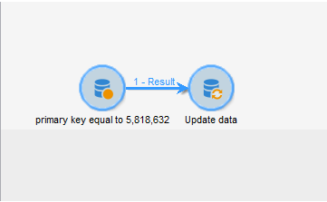

# Det gick inte att ta bort WebApp - FEL: dubblettnyckelvärdet bryter mot den unika begränsningen &quot;xtkdictionarystring_name&quot;

## Beskrivning


Ibland kan det hända att du inte kan ta bort en WebApp och kan få följande fel:

```
PGS-220000 PostgreSQL error: ERROR: duplicate key value violates unique constraint "xtkdictionarystring_name."

DETAIL: Key (iobjectid, ssourceid, slocale) = (0, del_5818632_closedFormLog, en) already exists.
```

## Upplösning


Om du får det här felet i ACC när du tar bort det webbprogram som inte längre behövs är lösningen att ta bort webbappen via [!UICONTROL Workflow] (se nedan)

- Skapa ett nytt arbetsflöde och släpp en fråga och uppdateringsaktivitet på arbetsytan.

- Fråga primärnyckeln för webbprogrammet och uppdatera åtgärdstypen som [!UICONTROL Delete] in [!UICONTROL Update data] aktivitet. Observera att när appen har tagits bort går det inte att hämta den om inte databasåterställningen är klar.





