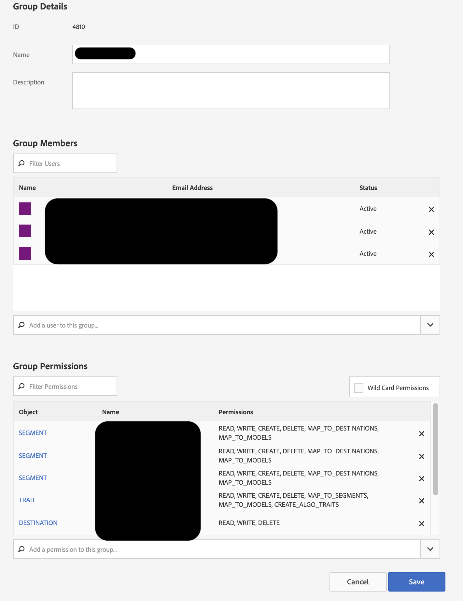

# AAM kan inte länka AD-grupp till AAM

## Beskrivning {#description}

<b>Miljö</b>

Adobe Audience Manager

<b>Problem/symtom</b>

Hur synkroniserar man en Admin Console-produktprofil till en RBAC-behörighetsgrupp (Audience Manager Role-Based Access Control)?

## Upplösning {#resolution}

Du måste ha administratörsåtkomst till Audience Manager samt produktadministratörsåtkomst i Admin Console.

1. Skapa en RBAC-behörighetsgrupp i Audience Manager. Observera det behörighetsgruppsnamn du väljer:

   
2. Navigera till Audience Manager-produkten i Admin Console och skapa en ny produktprofil, och markera behörighetsgruppen du just skapade i listrutan:

   
3. Lägg till relevanta användare i produktprofilen som du just skapade:

   
