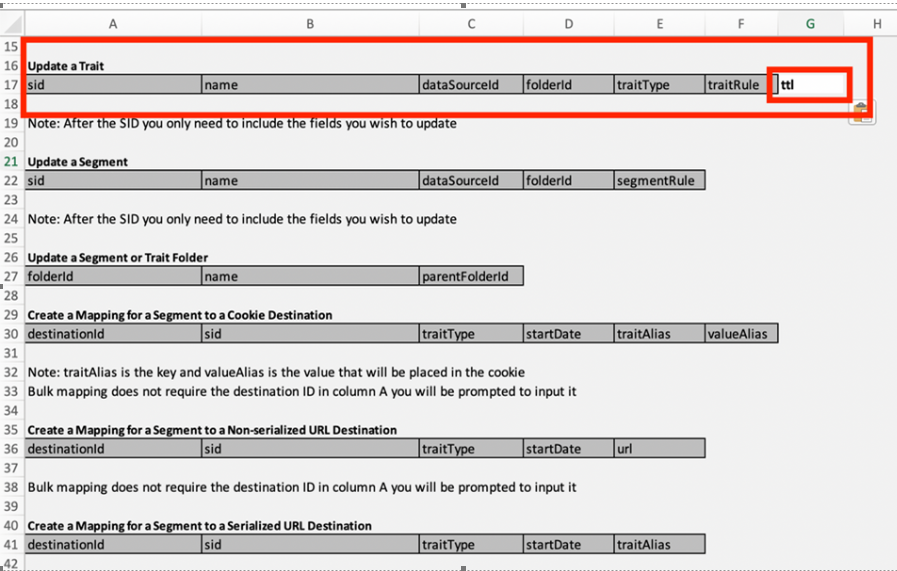

# Ändra förfallodatum/TTL för traits in Bulk med BAAAM-verktyget

Lär dig hur du ändrar time-to-live-of-Traits i grupp med verktyget Gruppera målgruppsassocieringshanterare.

## Beskrivning {#description}

Så här ändrar du&quot;time-to-live&quot; för flera team med BAAM-verktyget (Batch Audience Association Manager Tool).

## Upplösning {#resolution}

Referens [Masshanteringsverktyg för Audience Manager](https://experienceleague.adobe.com/en/docs/audience-manager/user-guide/reference/bulk-management-tools/bulk-management-intro) för mer information om BAAAM-verktyget.

Justera rubrikerna för att lägga till ett TTL-fält och ändra dina inställningar - se skärmbilden nedan

- Du måste ha tillgång till redigeringsegenskaperna.
- Kontrollera att du skickar rätt värdeuppsättning för SID, TRAIT-TYP osv. Använd i tveksamma fall alternativet &quot;Request Traits&quot; i BAAAM-verktyget (verktyget Batch Audience Association Manager) för att hämta befintliga detaljer och använda dem i dina förfrågningar.

