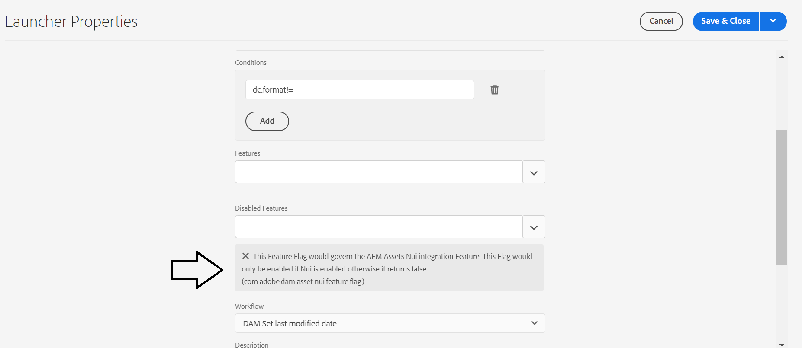

# Startfel för arbetsflödet &quot;DAM Set last modified date&quot; efter uppdatering

Ta bort <b>`com.adobe.dam.asset.nui.feature.flag `</b>-flaggan, så fungerar starchfunktionen som förväntat.

## Beskrivning {#description}

<b>Miljö</b>
Adobe Experience Manager (AEM)

<b>Problem</b>
Efter den senaste AEM som molnuppdatering (2022.4.7138.20220427T075748Z), en anpassad startfunktion för <b>DAM Ange senaste ändringsdatum</b> starten av arbetsflödet aktiveras inte.

En startfil för arbetsflödet skapades för att uppdatera det senaste ändrade datumet till resurser i en viss mapp när användaren ändrar metadata.
Startprogrammet är en kopia av standardprogrammet, men det skapades under `/conf` mapp och inte `/libs`.

Efter den senaste SDK-uppgraderingen körs inte längre startprogrammet.

<u>Förutsättningar</u>:

Ett paket med den kundskapade startappen som kör <b>DAM Ange senaste ändringsdatum</b> arbetsflöde för en anpassad resursmapp i en <b>AEMaaCS</b> miljö.

<u>Förutsättningar för att återskapa</u>:

1. Installera det kundskapade paketet.

2. Skapa samma mappstruktur som den som används av kunden i <b>AEM - tillgångar</b>.

3. Lägg till resurser i den tidigare skapade mappen.

4. Ändra metadata (exempel: *Titel*) för en resurs i den angivna mappen.

<u>Förväntade resultat</u>:

The `jcr:LastModified` datum ska uppdateras.

<u>Faktiska resultat</u>:

The `jcr:LastModified` datumet har inte ändrats.

## Upplösning {#resolution}

<b>Lösning</b>
AEM som molntjänst <b>DAM Ange senaste ändringsdatum</b> starcher, har <b>`com.adobe.dam.asset.nui.feature.flag`</b> flagga <b>Aktiverad</b>:

&quot;<b>Den här funktionsflaggan styr AEM Assets Nui-integreringsfunktionen. Den här flaggan aktiveras bara om Nui är aktiverat, annars returneras false. (`com.adobe.dam.asset.nui.feature.flag`).</b>&quot;

När flaggan har tagits bort fungerar startprogrammet som förväntat.
