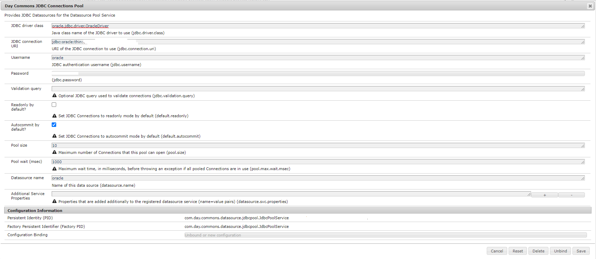

# Hur ansluter jag Oraclets databas från AEM som en molntjänst?


I den här artikeln finns information om hur du ansluter Oracle-databasen från Adobe Experience Manager (AEM) som en molntjänst.

## Beskrivning {#description}


<b>Miljö</b>

Adobe Experience Manager

<b>Problem/symtom</b>

Hur ansluter jag Oraclets databas från AEM som en molntjänst?


## Upplösning {#resolution}


Så här ansluter du Oraclets databas från AEM som en molntjänst:

- Lägga till Maven-beroende i Tom

- AEM Service för att ansluta till Oraclets databas

- OSGi-konfiguration

<u><b>Lägga till Maven-beroende i Tom</b></u>

<b>Steg 1:</b> Inkludera det här maven-beroendet i huvudprojektet `pom.xml`


```
<dependency>
 <groupId>com.oracle.database.jdbc</groupId>
 <artifactId>ojdbc-bom</artifactId>
 <version>21.5.0.0</version>
 <type>pom</type>
 <scope>import</scope>
 </dependency>
```


<b>Steg 2: </b>Inkludera beroendet nedan i `pom.xml` av både &quot;core&quot; och &quot;all&quot;.


```
<dependency>
 <groupId>com.oracle.database.jdbc</groupId>
 <artifactId>ojdbc8</artifactId>
 </dependency>
 <dependency>
 <groupId>com.oracle.database.jdbc</groupId>
 <artifactId>ucp</artifactId>
 </dependency>
 <dependency>
 <groupId>com.oracle.database.xml</groupId>
 <artifactId>xdb</artifactId>
 </dependency>
```


<u><b>AEM Service för att ansluta till Oraclets databas</b></u>

Exempel på tjänstkod för att ansluta till databasen från AEM som en molntjänst. Den kan inkluderas i sökvägen {0}

path {0}&quot; project folder&quot; core service

<b>DatabaseService.java</b>


```
package com.mysite.core.services;
public interface DatabaseService {
}
```


<b>DatabaseServiceImpl.java</b>


```
package com.mysite.core.services;
import com.day.commons.datasource.poolservice.DataSourcePool;
import org.osgi.service.component.annotations.Activate;
import org.osgi.service.component.annotations.Component;
import org.osgi.service.component.annotations.Reference;
import org.slf4j.Logger;
import org.slf4j.LoggerFactory;
import javax.sql.DataSource;
import java.sql.Connection;
@Component(
 service = DatabaseService.class,
 immediate = true
)
public class DatabaseServiceImpl implements DatabaseService {
 private final Logger LOGGER = LoggerFactory.getLogger(DatabaseService.class);
 @Reference
 private DataSourcePool dataSourcePool;
 @Activate
 public void activate() {
 try {
 DataSource dataSource = (DataSource) dataSourcePool.getDataSource("oracle");
 Connection connection = dataSource.getConnection();
 if (connection != null) {
 if (!connection.isClosed()) {
 LOGGER.info("Connected with connection #4");
 connection.close();
 }
 }
 else {
 LOGGER.info("Connection is null");
 }
 } catch (Exception ex) {
 LOGGER.error("It was not possible to get the data source: " + ex.getMessage(), ex);
 }
 }
}
```


<u><b>OSGi-konfiguration</b></u>

<b>Steg 1:</b> Gå till AEM OSGi-konfiguration (http://localhost:4502/system/console/configMgr) lokalt.

<b>Steg 2:</b> Sök efter&quot;JDBC Connection pool&quot; och konfigurera nedanstående värden med avseende på din databas (se skärmbild för exempelvärden)

- Klassen JDBC Driver
- URL för JDBC-anslutning
- Användarnamn och lösenord
- Datakällans namn




<b>Steg 3:</b> Följ stegen på länken nedan och konvertera OSGi-konfigurationen till `.cfg.json` och lägg till samma i projektkonfigurationen enligt AEMaaCS Standard.

[https://experienceleague.adobe.com/docs/experience-manager-cloud-service/content/implementing/deploying/configuring-osgi.html?lang=en#generating-osgi-configurations-using-the-aem-sdk-quickstart](https://experienceleague.adobe.com/docs/experience-manager-cloud-service/content/implementing/deploying/configuring-osgi.html?lang=en#generating-osgi-configurations-using-the-aem-sdk-quickstart)
