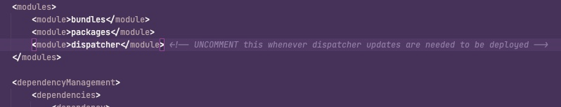

# Inaktivering av Dispatcher-distributionen


I den här artikeln får du hjälp med att lösa *Det gick inte att starta Apache på grund av syntaxfel i distribuerade konfigurationer* fel som inträffar under körningen av en distributionspipeline.

## Beskrivning {#description}


### <b>Miljö</b>

Experience Manager 6.5


### <b>Problem/symtom</b>

Under körningen av pipeline för distribution genereras följande fel:


```
2022-06-21T14:16:54+0000 Deploy to instanceId=dispatcher1southafricanorth failed with errorCode=10011001 message=Failed to start Apache due to syntax error in deployed configurations. Config variables are not defined: DISP_LOG_LEVEL AH00534: httpd: Configuration error: No MPM loaded.
2022-06-21T14:16:54+0000 Failed to deploy dispatcher on instance dispatcher1southafricanorth. ActionId=671j71en7qt3mcp1mnlnjv13h9
2022-06-21T14:16:55+0000 Deploy to instanceId=dispatcher2southafricanorth failed with errorCode=10011001 message=Failed to start Apache due to syntax error in deployed configurations. Config variables are not defined: DISP_LOG_LEVEL AH00534: httpd: Configuration error: No MPM loaded.
2022-06-21T14:16:55+0000 Failed to deploy dispatcher on instance dispatcher2southafricanorth. ActionId=225ftn5ham417fmuaccae2n8ck
```


## Upplösning {#resolution}


Kommentera ut eller ta bort dispatchermodulen från huvudmodulen `pom.xml` (se nedan). Sedan hämtar den pipeline som den kommer att hoppa över ändringar av dispatchern och distribuera endast AEM kodbas över utgivaren och författaren.


