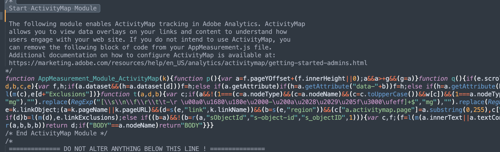

# Hur inaktiverar jag insamling av Active Map-data?

## Beskrivning

Av någon anledning vill vi inte längre samla in Active Map-data. Hur kan vi inaktivera Active Map-datainsamlingen?
  

## Upplösning

- <b>Om Adobe Analytics-biblioteket hanteras på en kundserver (AppMeasurement.js självvärd)</b>

Ta bort modulen AppMeasurement_Module_ActivityMap från filen AppMeasurement.js

- <b>Om Adobe Analytics-biblioteket hanteras på Adobe (AppMeasurement.js via Adobe CDN)</b>

I gränssnittet för AEP Data Collection(Launch) går du till konfigurationen av Adobe Analytics Extension och inaktiverar Activity Map genom att avmarkera rutan. Publicera sedan bygget

- 

- <b>När du har inaktiverat Active Map kontrolleras inte att modulen Active Map har lästs in via webbläsarens konsolmeny med kommandot s_c_il</b>

Modulen Aktiv karta har lästs in

Modulen Aktiv karta har inte lästs in

- <b>När du har inaktiverat Active Map kontrollerar du Adobe Analytics serveranrop via webbläsarens nätverksmeny</b>.

