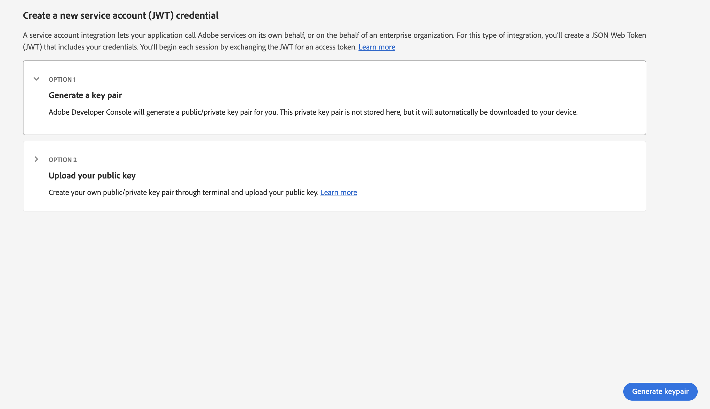
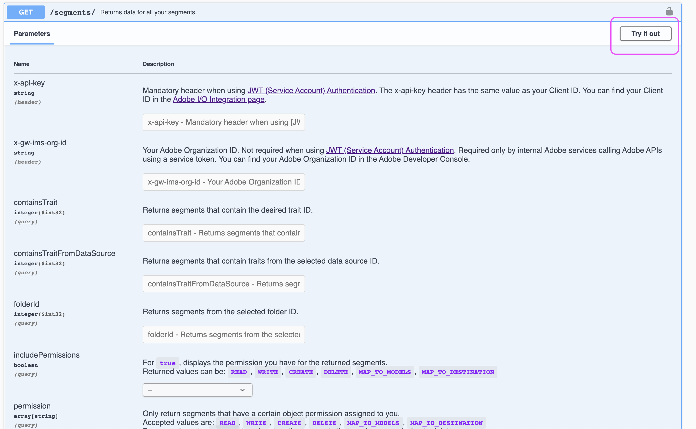

# Konfigurera AAM API-åtkomst

## Beskrivning

I den här artikeln beskrivs hur du skapar ett projekt i utvecklarkonsolen för att generera JWT-autentiseringsuppgifter för Audience Manager API.

## Upplösning

Du måste ha systemadministratörsbehörighet i Admin Console för att kunna generera autentiseringsuppgifter för API:t för Audience Manager. Steg 1 och 2 visar i stora drag hur du beviljar dessa eskalerade behörigheter. Dina nuvarande systemadministratörer föredrar kanske att följa dessa steg själva i stället för att ge en ytterligare användare utökad administratörsbehörighet, och i så fall går du direkt till steg 3.

1. Navigera till [Admin Console](https://adminconsole.adobe.com/) och markera [!UICONTROL Add admins] från [!UICONTROL Quick links] meny:

   

1. Ange e-postmeddelanden för alla användare som du vill ge åtkomst till. På nästa sida väljer du &quot;[!UICONTROL System administrator]&quot; för behörighetsnivån:

   

1. Navigera till [https://developer.adobe.com/console](https://developer.adobe.com/console) . Om du inte har åtkomst än, trots att du har tilldelats systemadministratörsbehörighet i föregående steg, kan du försöka med att uppdatera dina cookies/cacheminnen.

1. Skapa ett nytt projekt från [!UICONTROL Quick start] meny (eller [!UICONTROL Projects] i den övre navigeringsmenyn):

   

1. Lägg till Audience Manager API i ditt projekt:

   

   

1. Följ stegen för att generera (eller överföra) dina JWT-autentiseringsuppgifter. Om du väljer att generera autentiseringsuppgifterna via dev-konsolen måste du lagra den privata nyckeln på ett säkert sätt. Du behöver din privata nyckel i senare steg. 

   

1. Därefter uppmanas du att tilldela autentiseringsuppgifterna till relevanta produktprofiler. Om din organisation använder rollbaserade åtkomstkontroller måste du följa de här stegen för att skapa ett tekniskt användarkonto och lägga till kontot i den relevanta RBAC-gruppen: [https://experienceleague.adobe.com/docs/audience-manager/user-guide/api-and-sdk-code/rest-apis/aam-api-getting-started.html?lang=en#technical-account-rbac-permissions](https://experienceleague.adobe.com/docs/audience-manager/user-guide/api-and-sdk-code/rest-apis/aam-api-getting-started.html?lang=en#technical-account-rbac-permissions)

1. När de här stegen är slutförda kan du generera en åtkomsttoken och göra din första API-begäran. Klicka först på sidan Översikt över autentiseringsuppgifter i dev-konsolen:

   

1. Klicka på fliken&quot;Generera JWT&quot; överst på sidan och klistra in hela den privata nyckeln från filen som laddades ned i steg 6. Klicka sedan på&quot;Generera token&quot;:

   

Slutligen kan du göra API-begäranden med åtkomsttoken som hämtades i föregående steg. Anrop kan göras från alla API-plattformar, till exempel [!DNL Postman], direkt via cURL-kommandon, eller till och med från API-dokumentationssidan: [https://bank.demdex.com/portal/swagger/index.html#/](https://bank.demdex.com/portal/swagger/index.html#/)

Om du vill ringa samtal med demonstrationsfunktionerna i vår dokumentation följer du stegen ovan för att generera din token och klickar sedan på Auktorisera till höger på sidan och anger din token:

Se även till att du väljer servern aam.adobe.io, vilket visas på skärmbilden ovan. Nu kan du använda demofunktionen på alla API-begäranden genom att ange relevanta parametrar och klicka på knappen Testa:

Tänk på att detta skickar en riktig API-begäran till din instans. Om du använder en `DELETE`, `PUT`, eller `POST` kan du göra oönskade ändringar i instansen. Läs alltid noggrant dokumentationen för vart och ett av dessa API-anrop innan du skickar begäran.
