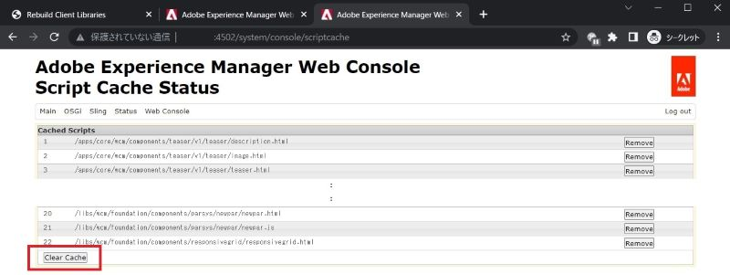

# Adobe Experience Manager: Så här rensar du cacheminnet för HTML/JSP/JS/CSS för anpassade komponenter

När du ändrar HTML-/JSP-/JS-/CSS-filer för den anpassade komponenten kanske inte AEM omedelbart återspeglar ändringarna av sidorna med komponenten. Det interna cacheminnet måste vara orsaken. Den här artikeln hjälper dig att förstå hur du rensar cacheminnet för dessa filer.

## Beskrivning {#description}

### <b>Miljö</b>

Experience Manager 6.5

### Problem/symtom

När du ändrar HTML-/JSP-/JS-/CSS-filer för de anpassade komponenterna kanske inte AEM omedelbart återspeglar ändringarna av sidorna med komponenten. I det här fallet kan den interna cachen vara en orsak.
Lär dig hur du rensar cachen för dessa filer.

## Upplösning {#resolution}

Du kan rensa cacheminnet med följande funktioner:

1. Klientbibliotek: JS/CSS-filer

   Återskapa klientbibliotek > Invalidera cacher eller Återskapa bibliotek

      http://localhost:4502/libs/granite/ui/content/dumplibs.rebuild.html 

        
2. Inläsare för filsystemklass: JSP, HTL

   Web Console > Sling > File System Class Loader > Clear Class Loader

      http://localhost:4502/system/console/fsclassloader

        
3. Skriptcache: HTML, JS-fil

   Webbkonsol > Sling > Skriptcachestatus > Rensa cache

      http://localhost:4502/system/console/scriptcache

        

Du bör rensa cacheminnet i en lugn tid för att undvika prestandaförsämringar.
Du kan också behöva kontrollera dispatchercachen och webbläsarcachen.
