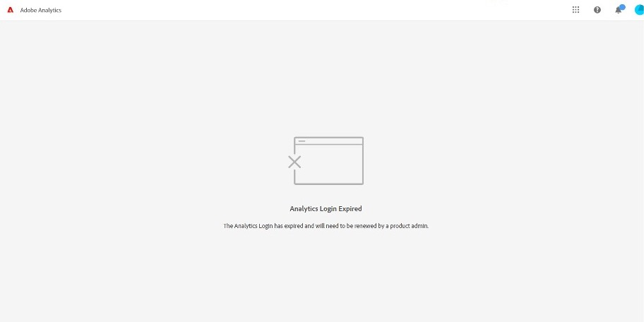

# Det går inte att komma åt Adobe Analytics på grund av att inloggningen för Analytics har upphört att gälla

## Beskrivning

Ett felmeddelande visas nedan när du använder Adobe Analytics.
  
 Analysinloggningen har upphört att gälla
 Analysinloggningen har upphört att gälla och måste förnyas av en produktadministratör.
    

## Upplösning

Detta inträffar eftersom det aktuella datumet ligger utanför det giltiga datumintervallet för kontot. Samarbeta med en Analytics-administratör i organisationen för att utöka det giltiga datumintervallet för inloggningen. Adobe kundsupport har inte behörighet att ändra giltiga inloggningsdatumintervall för användarkonton.

1. Som Analytics-administratör går du till Adobe Analytics Admin Analytics-användare och -resurser
2. Välj ett användar-ID i fråga
3. I fönstret Användarhantering utökar du det giltiga datumintervallet Inloggning giltig från (mm/dd/yy): och till (mm/dd/yy):. Eller avmarkera kryssrutan.

・Utgångna inloggningar
[https://experienceleague.adobe.com/docs/analytics/technotes/troubleshoot-login.html?lang=en#expired-logins](https://experienceleague.adobe.com/docs/analytics/technotes/troubleshoot-login.html?lang=en#expired-logins)
