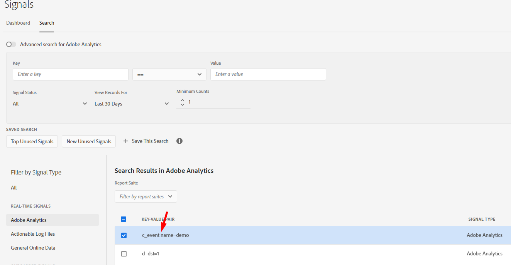

# Ett fel uppstod när det nya varumärket skulle skapas från kontrollpanelen för signaler

## Beskrivning

När jag skapar nya egenskaper från signaler som finns på kontrollpanelen för signaler visas följande fel:

Signalen som jag försöker använda är:

## Upplösning

Det angivna felet anger att tangenten i signalen bara kan innehålla dubbla citattecken (&quot;), punkt (.), bindestreck (-) och understreck (_).

När man tittade närmare på signalerna identifierades det att det innehöll ett blanksteg som markerades nedan på grund av att trait-valideringen misslyckades.

Det är mycket viktigt att välja rätt signaltillstånd.

Referenser:

Trait Rules- [https://experienceleague.adobe.com/docs/audience-manager/user-guide/features/traits/trait-builder/manage-trait-rules.html?lang=en](https://experienceleague.adobe.com/docs/audience-manager/user-guide/features/traits/trait-builder/manage-trait-rules.html?lang=en)

Namnkrav - [https://experienceleague.adobe.com/docs/audience-manager/user-guide/features/traits/trait-key-name-requirements.html?lang=en](https://experienceleague.adobe.com/docs/audience-manager/user-guide/features/traits/trait-key-name-requirements.html?lang=en)
