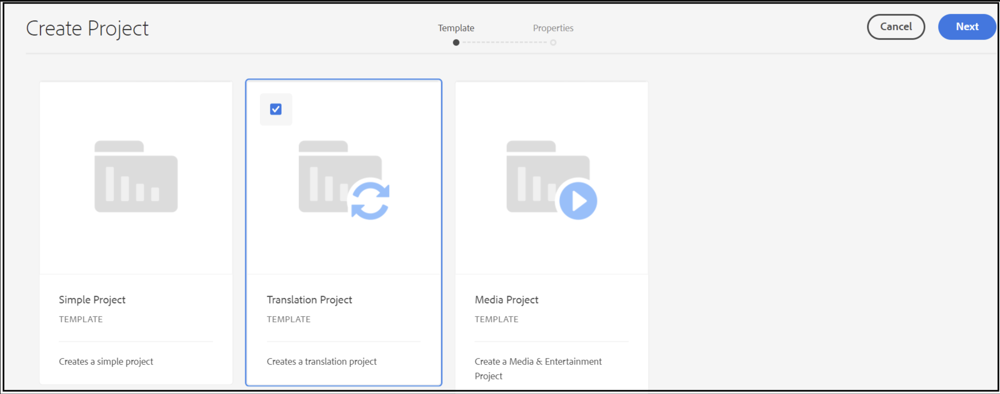

# Ingen projektmall är tillgänglig

För att projektmallarna ska vara synliga i AEM, egenskapen `cq:allowedTemplates` av typen `String[ ]` och värdet <b>/(apps|libs)/.\*/projekt/mallar/.\* </b> måste finnas under <b>/content/projects/jcr:content</b>.

## Beskrivning {#description}

### Miljö

Adobe Experience Manager (AEM)

### Problem

Även om användaren har alla nödvändiga privilegier som tilldelats i Admin Console, inklusive administratörsrättigheter, när han/hon försöker skapa ett nytt projekt från <b>AEM </b>`>`  <b>Projekt</b> `>`  <b>Skapa</b> `>`  <b>Projekt</b>, det finns ingen projektmall tillgänglig vilket innebär att inget projekt kan skapas.

Enligt användarhandboken [AEM levereras med tre olika mallar](https://experienceleague.adobe.com/docs/experience-manager-cloud-service/content/sites/authoring/projects/overview.html?lang=en#project-templates)ur förpackningen:

- Ett enkelt projekt: Ett referensexempel för projekt som inte passar in i andra kategorier (en&quot;catch-all&quot;). Det innehåller tre grundläggande roller (ägare, redigerare och observatörer) och fyra arbetsflöden (projektgodkännande, begäranstart, begäranstartsida och e-postbegäran).
- Ett medieprojekt: Ett referensexempelprojekt för medierelaterade aktiviteter. Det innehåller flera medierelaterade projektroller (fotografer, redigerare, copywriters, designers, Owners och Observers).
- A [översättningsprojekt](https://experienceleague.adobe.com/docs/experience-manager-cloud-service/content/sites/administering/reusing-content/translation/overview.html?lang=en): Ett referensexempel för hantering av översättningsrelaterade aktiviteter. Det innehåller tre grundläggande roller (ägare, redigerare och observatörer). Det innehåller två arbetsflöden som du kommer åt i användargränssnittet för arbetsflöden.

   
Kunden kan dock inte se någon av dessa mallar.

## Upplösning {#resolution}

För att projektmallarna ska vara synliga i AEM, egenskapen `cq:allowedTemplates` av typen `String[ ]` och värdet <b>/(apps|libs)/.\*/projekt/mallar/.\* </b> måste finnas under <b>/content/projects/jcr:content</b>.

Problemet berodde på att kunden inte hade `jcr:content node` under */content/projects*. När du har skapat `jcr:content node` och lägga till `cq:allowedTemplates` kan kunden se alla tre projektmallarna.

