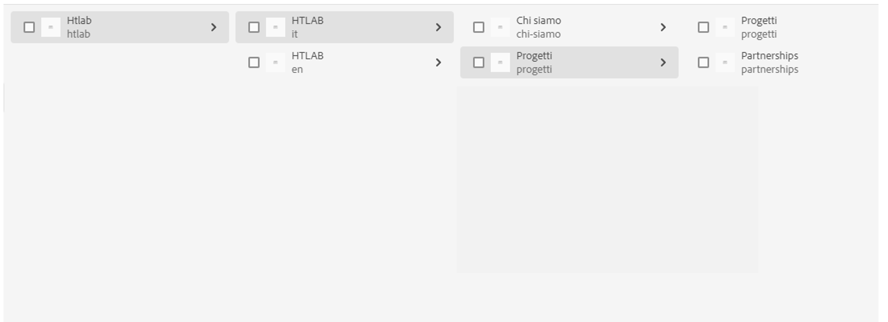

# Replikeringsproblem

## Beskrivning

En kund ställdes inför följande problem: Deras webbplats hade två språkgrenar - italienska (it) och engelska (en) - med samma innehåll, där den engelska grenen var en live-kopia av den italienska.

Engelska &quot;*projekt*&quot; sidan hade namnet &quot;*progetti*&quot; men det hade också ett alias som är inställt på &quot;*projekt*&quot; därför borde den ha varit tillgänglig både på http://Publisher.URL/content/htlab/en/progetti.html och http://Publisher.URL/content/htlab/en/projects.html.
Men bara om du öppnar via*progetti*&quot; de rätta underordnade visades som tillgängliga länkar på sidan - &quot;*projekt*&quot; och &quot;*partnerskap*&quot;.

När den öppnades via*projekt*&quot; de underordnade som visades var &quot;*projekt*&quot; och en felaktig sida &quot;*partnerskap*&quot; även om sidan inte fanns i författaren.

## Upplösning

Det hittades att i utgivarens databas förutom det korrekta *progetti*&quot; sidan där det också fanns en sida med namnet &quot;*projekt*&quot; som innehåller fel sida &quot;*partnerskap*&quot; som barn.
Kanske skapades den vid något tillfälle och togs sedan bort utan att den publicerades, och den cachelagrades också.
Problemet har korrigerats efter att hela*Projekt*&quot; sida under en och följande steg:

1. Skapa en live-kopia av den italienska &quot;*progetti*&quot; utan att ta med underordnade och med egenskaperna: Namn: projekt, titel: Projekt
2. Skapa live-kopior för de underordnade för *progetti*&quot; sida som nedan:              - för &quot;*progetti*&quot;, skapa en live-kopia med namnet &quot;projects&quot; och titeln &quot;Projects&quot; - för &quot;*partnerskap*&quot; skapa en live-kopia med namnet &quot;partnerskap&quot; och titeln &quot;partnerskap&quot;
3. Publicera nyligen skapade sidor
4. Avpublicera sidorna
5. Ta bort hela &quot;p *projekt*&quot; sida igen.

På det här sättet *projekt*&quot; togs även bort från utgivarens databas tillsammans med det felaktiga &quot;*partnerskap*&quot;en.
