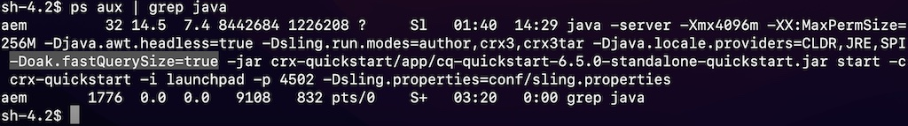

# Adobe Experience Manager: Så här kontrollerar du konfigurationer när antalet träffar verkar felaktigt

## Beskrivning

När det faktiska antalet sökresultat skiljer sig från antalet träffar för en fråga, kan alternativet fastQuerySize anges som aktiverat (true).
 Det finns flera sätt att aktivera alternativet fastQuerySize. I den här artikeln beskrivs hur du konfigurerar på olika sätt.
  

## Upplösning

<b>OSGi-konfiguration</b>:Web Console > Configuration > Apache Jackrabbit Query Engine Settings Service > Fast result size

http://localhost:4502/system/console/configMgr/org.apache.jackrabbit.oak.query.QueryEngineSettingsService Kontrollera&quot;Snabb resultatstorlek&quot; och Spara.
   

<b>Java-konfiguration</b>:-Doak.fastQuerySize=true

Lägg till systemegenskapen nedan i AEM startskript (crx-quickstart/bin/start).
        CQ_JVM_OPTS=&quot;${CQ_JVM_OPTS} -Doak.fastQuerySize=true&quot;

Den här konfigurationen åsidosätter OSGi-konfigurationen.
    

<b>JMX</b>:Webbkonsol > JMX > org.apache.jackrabbit.oak: inställningar (QueryEngineSettings)

http://localhost:4502/system/console/jmx/org.apache.jackrabbit.oak%3Aname%3Dsettings%2Ctype%3DQueryEngineSettings Ändra&quot;Snabb resultatstorlek&quot; till true och Spara.

Detta konfigurationsvärde vid JMX åsidosätter andra konfigurationer. Om du startar om AEM återställs värdet.

