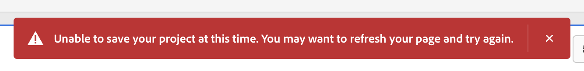

# Adobe Analytics: Det gick inte att spara projektet på grund av nätverksfel

## Beskrivning {#description}

### Miljö

- Adobe Analytics

### Problem/symtom

Följande felmeddelande visas då och då när du försöker spara projektet.

 &quot;Det går inte att spara projektet just nu. Du kanske vill uppdatera sidan och försöka igen.&quot;  

## Upplösning {#resolution}

Den troligaste orsaken till detta är nätverksstörningar. Kontrollera IP-adresser och domäner som används av Adobe Analytics och ta bort dem från filtret på brandväggen eller proxyservern i din miljö.
 
・IP-adresser och domäner som används av Adobe Analytics
[https://experienceleague.adobe.com/docs/analytics/technotes/ip-addresses.html?lang=en](https://experienceleague.adobe.com/docs/analytics/technotes/ip-addresses.html?lang=en)
