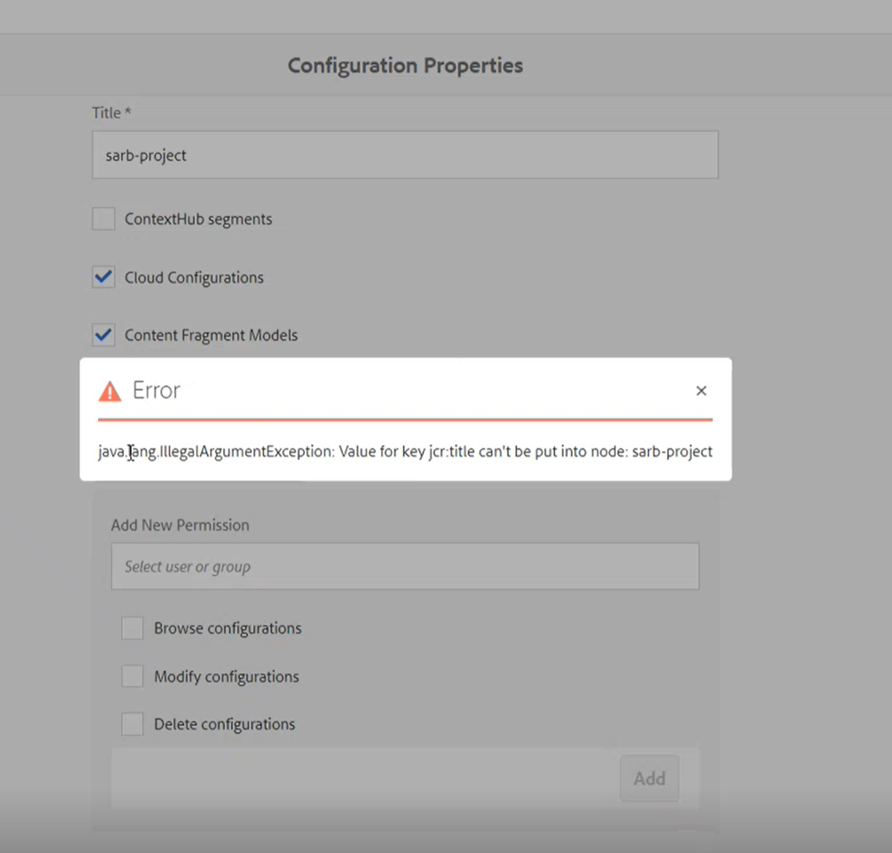

# Det går inte att hitta vår AEM projektsökväg i molnkonfigurationen för innehållsfragment

## Beskrivning {#description}

<b>Miljö</b>

- Adobe Experience Manager

<b>Problem/symtom</b>

1. Skapa en innehållsfragmentmodell under Verktyg/Resurser.
2. Gå till Resurser/Filer/Projektnamn/Skapade en fragmentmapp.
3. I mappen Fragment kan du försöka skapa ett innehållsfragment och bara standardfragmentet visas (enkelt fragment).
4. Baserat på AEM dokumentation går du ett steg bakåt och väljer mappen.
5. Klicka på Egenskaper/Molntjänster/Molnkonfiguration när du vill välja sökvägen.
6. Du kan se alla standardprojekt som WKND eller we.retail, men du kan inte hitta projektnamnet för att navigera till modellen för att skapa ett innehållsfragment.
7. Följande fel uppstod när konfigurationen skulle ändras: <b>java.lang.IllegalArgumentException: Värdet för nyckeln jcr:title kan inte placeras i noden:</b>

      [https://experienceleague.adobe.com/docs/experience-manager-65/administering/introduction/configurations.html?lang=en](https://experienceleague.adobe.com/docs/experience-manager-65/administering/introduction/configurations.html?lang=en)      

## Upplösning {#resolution}

Byt namn på noden i CRXDE, skapa en ny med samma namn och kopiera över egenskaperna.

<b>Orsak</b>

Problemet är att noden under `/conf` har `jcr:primaryTyp `egenskapsuppsättning som *nt:mapp*, i stället för `sling:Folder`.
Eftersom den här noden har fel typ hämtas den inte som en giltig sökväg av konfigurationsläsaren.
