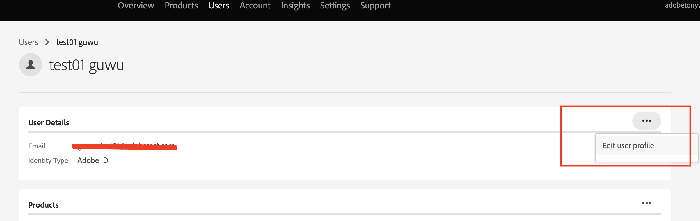

# Hur uppdaterar du användar-ID-namnet i Admin Console?

I den här artikeln finns information om hur du uppdaterar användar-ID-namnet i Admin Console i Adobe.

## Beskrivning {#description}

### <b>Miljö</b>

Analytics 

### Problem/symtom

Användar-ID (Federated ID, Enterprise ID eller Adobe ID) har systemadministratörsbehörighet, men <b>Redigera användarprofil</b> menyn för användar-ID i Admin Console är inte synlig. Så här uppdaterar du användar-ID-namnet, `test01 guwu` i följande bild? 

## Upplösning {#resolution}

ID-typ: Federated ID, Enterprise ID eller Adobe Be en annan systemadministratör i din organisation att uppdatera din ID-profil. Andra systemadministratörer har åtkomst till <b>Redigera användarprofil</b> av ditt användar-ID via Admin Console.

ID-typ: Business ID <b>Redigera användarprofil</b> alternativet är inte tillgängligt för <b>Företags-ID </b>-användare. Det innebär att dessa användare måste uppdatera sina profiler [här](https://account.adobe.com/profile). Mer information finns i [Uppdatera din kontoprofil](https://helpx.adobe.com/manage-account/using/edit-adobe-account-personal-profile.html).
 
Referens: Mer information finns på länken - [Hantera användare individuellt](https://helpx.adobe.com/enterprise/using/manage-users-individually.html)
