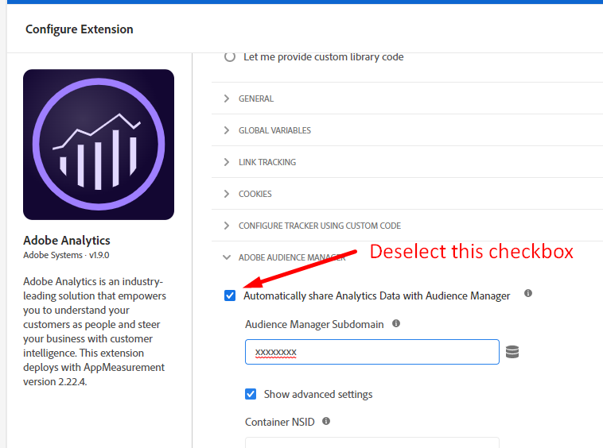

# Ta bort Audience Manager-samtal

## Beskrivning {#description}

<b>Miljö</b>
Audience Manager
<b>Problem/symtom</b>  Hur tar jag bort alla serversamtal eller dataflöden till Audience Manager? 

## Upplösning {#resolution}

Du kan ta bort Audience Manager helt genom att ta bort associationen från följande platser:

1. Tar bort DIL-kod
2. Ta bort serversidsvidarebefordran i Adobe Analytics-biblioteket
3. Avpublicera alla analyssegment
4. Stoppa import/export-arbetsflöden i Adobe Campaign
5. Avbryta Adobe Target-samtal
6. Stoppa DCM-logginmatning, pixelanrop från tredje part
7. Stoppa alla destinationer och dela data med andra eller tredje part
8. Stoppa alla offlinedatainmatningar

<b>Tar bort DIL-kod</b>

1. Identifiera följande funktion i koden och ta bort dem:

   1. DIL.create
   2. DILinstance.api.signals().submit()
   3. DIL.modules.siteCatalyst.init `[` Om du vidarebefordrar data till Adobe Analytics`]`
   4. GA.submitUniversalAnalytics(); ELLER GA.submitUniversalAnalytics();  `[` Om du vidarebefordrar data till Google Analytics`]`
2. När du har tagit bort funktionen ovan måste du även ha tagit bort DIL JS-biblioteket från koden.

<b>Resultat</b>: Publicera och ladda om webbplatsen, du ska INTE se något samtal som [https://subdomain.demdex.net/event?...](https://subdomain.demdex.net/event?....)

<b>Tar bort vidarebefordran på serversidan</b>

1. Gå till rapportsviterna för Analytics som är aktiverade för vidarebefordran på serversidan och inaktivera kryssrutan.

 

1. När steget ovan är klart går du in i din AppMeasurement.js-kod och tar bort kod som du ser nedan. Avmarkera kryssrutan Vidarebefordra Audience Manager om du har startat.

             

<b>Resultat</b>: Analysanropssvaret ska vara tomt.

<b>Avpublicera alla analyssegment</b>
Gå in i enskilda Analytics-segment som publiceras och avpublicera dem.
<b>Resultat</b>: Segmentdelning offline avbryts från Analytics till Audience Manager.

<b>Stoppa import/export-arbetsflöden i Adobe Campaign</b>
Från Audience Manager: Ta bort alla era Campaign-mål från Campaign: Du kan antingen ta bort eller stoppa helt, import-/exportarbetsflöden från Campaign-gränssnittet.
<b>Resultat</b>: Segment som ska skickas från målgrupp till kampanj kommer att stoppas.

<b>Avbryta Adobe Target-samtal</b>
Kontakta kontoteamet på Adobe om du vill ha funktionen&quot;Delade målgrupper&quot; eller&quot;Bastjänster för människor&quot; inaktiverad av Provisioning Team.
<b>Resultat</b>: Target kommer inte att ringa fler samtal till Audience Manager.

<b>Stoppa DCM-logginmatning, pixelanrop från tredje part</b>
Om du har aktiverat DCM-logginmatning ska du stoppa det och inte överföra några ytterligare metadatafiler.
Om du har något aktivt intryck/klick/konverterar pixlar var som helst kan du få dem också stoppade.
<b>Resultat</b>: Ingen datainsamling från tredje part.

<b>Stoppa alla destinationer och dela data med andra eller tredje part</b>
URL och cookie-mål kan stoppas direkt från användargränssnittet.
För S2S-destinationer kan du kontakta supporten för att stoppa destinationerna helt.
<b>Resultat</b>: Inga data kommer att delas ut från Audience Manager.

<b>Stoppa alla offlinedatainmatningar</b>
Om du överför datafiler till Audience Manager ska du stoppa dem direkt.
<b>Resultat</b>: Inga offlinedata kommer att överföras.
