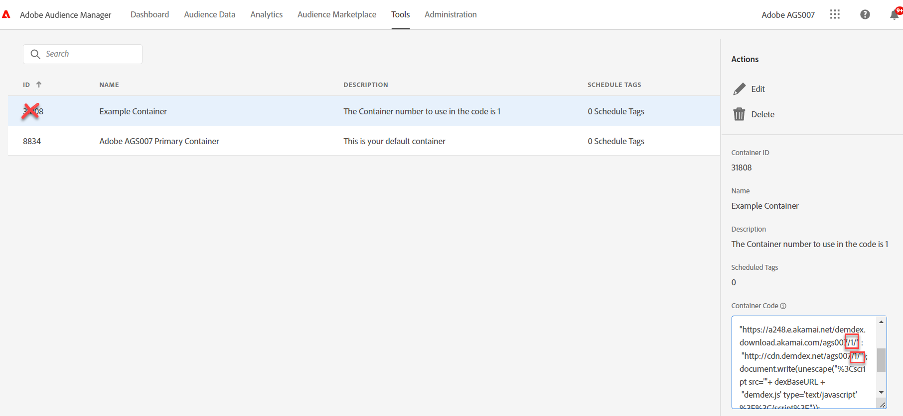

# Vad är mitt behållar-ID för Audience Manager (och/eller ID-tjänst) och var kan jag hitta det?

## Beskrivning {#description}

När ett annat behållar-ID än standardbehållar-ID (0) behövs för en AAM (och/eller ID-tjänst)-implementering, hur vet man vilket behållar-ID som ska användas? Är det behållar-ID:t i det AAM användargränssnittet eller något annat värde?

## Upplösning {#resolution}

När en AAM-implementering behöver använda ett annat behållar-ID i stället för standardbehållaren (0), är värdet som ska användas i ID-tjänsten och Audience Management Module för Analytics (eller i DIL-konfigurationskoden) behållarnumret baserat på när behållaren skapades, INTE behållar-ID i AAM. Så här hämtar du rätt värde:

1. Logga in på Audience Manager och klicka på Verktygstaggar
2. När sidan Taggar visas klickar du på behållaren i fråga
3. Leta reda på rutan Behållarkod i den högra listen
4. Leta reda på begäran akamai.net eller cdn.demdex.net. Talet i sökvägen precis efter klientorganisations-ID är det numeriska värdet som ska användas i koden. Använd INTE behållar-ID:t. I exemplet/skärmbilden nedan är värdet 1.

Obs! Koden i rutan Behållarkod är INTE kod som du ska placera i webbegenskaper. Det finns bara här för att hämta det behållarvärde som behövs för ID-tjänstens idSyncContainerID-konfiguration, behållar-NSID-värdet för Analytics Audience Management Module eller containerNSID-värdet för en DIL-implementering när något annat än standardbehållaren för ID-synkronisering behövs.

