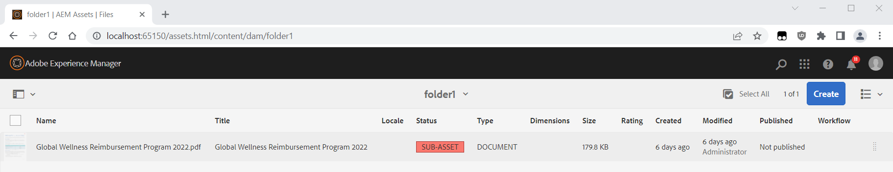

# SUB-ASSET-status visas för Tillgång

The <b>DELRESURS</b> status motsvarar den situation där tillgången har relaterade tillgångar vars *Digital Rights Management* datum har gått ut. Detta är ett specifikt scenario där huvudtillgången har gått ut. I den här artikeln beskrivs hur du löser problemet.

## Beskrivning {#description}

### <b>Miljö</b>

- Experience Manager
- Experience Manager 6.5
- Experience Manager Assets

### <b>Problem/symtom</b>

När du bläddrar bland resurserna visas en <b>*DELRESURS</b>*status:

Vad betyder det här?

## Upplösning {#resolution}

The <b>*DELRESURS</b>* status motsvarar när resursen har <b>hänförliga tillgångar</b> för vilka *Digital Rights Management* förfallodatum.

Detta är ett specifikt fall där huvudtillgången har upphört att gälla, vilket beskrivs här:

[https://experienceleague.adobe.com/docs/experience-manager-65/assets/administer/drm.html#asset-expiration](https://experienceleague.adobe.com/docs/experience-manager-65/assets/administer/drm.html?lang=en#asset-expiration)

Du kan kontrollera vilken relaterad resurs som har gått ut genom att öppna resursens egenskaper *Grundläggande* och observera *röd flagga* ikon:

The <b>hänförliga tillgångar</b> Det rör sig om två typer:

<u><b>#1 - Resursen är en PDF med undersidor</b></u>

Om du har ändrat din&quot;DAM Update Asset&quot; för att extrahera sidor från PDF skapas en underresurs för dokumentsidorna.

Varje extraherad sida är en resurs som lagras under huvudresursen i en undernod/mapp med namnet */delresurser* och har metadataegenskaper, inklusive DRM *Upphör* datum i *Avancerat*-fliken.

Om det *Upphör* datumet har passerat, ser du:

- den <b>*UPPHÖRT</b>* status för den här undersidan/resursen när du bläddrar bland de viktigaste PDF-underresurserna (med den övre vänstra listen växlar du från *Endast innehåll* visa för *Delresurser*)
- den <b>*DELRESURS</b>* status när du går tillbaka till PDF

Detta dokumenteras på följande sida `[` 0`]` .

<u><b>#2 - Resursen har referensresurser</b></u>

För alla typer av tillgångar är det möjligt att hänvisa till andra tillgångar. The <b>*DELRESURS</b>* status beräknas också genom att titta på *Upphör* datum för var och en av dessa referenser.

Referenserna lagras i en egenskap:

`<asset>/jcr:content/related/links/sling:members/sling:resources`

<u>Obs!</u>

Om resursen har för många referenser (flera tusen) kan det orsaka vissa prestandaproblem i användargränssnittet när resursegenskaperna visas.

Det kan ta för lång tid att kontrollera/beräkna statusen för alla dessa referenser, och begäran om att öppna egenskaperna kommer att göra timeout.

Det finns för många referenser som rör och som behöver undersökas, eftersom det kan orsaka prestandaproblem:

[https://jackrabbit.apache.org/oak/docs/dos_and_donts.html#Large_Multi_Value_Property](https://jackrabbit.apache.org/oak/docs/dos_and_donts.html#Large_Multi_Value_Property)

Om du vill åtgärda problemet och dessa relaterade referenser inte har något värde kan du ta bort följande mapp/undernod från CRX/DE:

*/content<b>t*`/.../<asset>/jcr:content/related/links`

<u><b>#3 - Tips för att kontrollera utgångna resurser</b></u>

Du kan använda följande JCR SQL2-fråga för att lista alla resurser i databasen som har ett förfallodatum:

`SELECT * FROM [ dam:Asset]  WHERE [ jcr:content/metadata/prism:expirationDate]  < cast('2023-01-02T17:00:00.000Z' as date)`

Ändra datumet till aktuell tid (i GMT-format).
