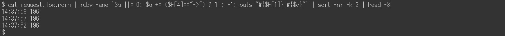
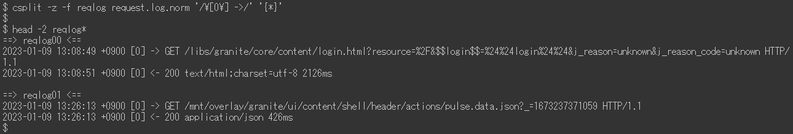
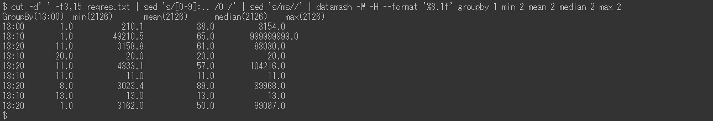
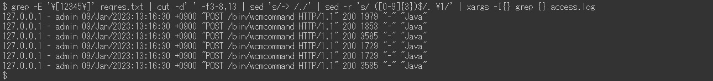

# Exempel på request.log-analys | AEM

## Beskrivning {#description}

### <b>Miljö</b>

Experience Manager 6.5

### <b>Problem/symtom</b>

Adobe Experience Manager (AEM) `request.log` innehåller olika användbar information, till exempel svarstid, för att analysera prestandaproblem. Här är en lista med exempel på analys med Linux-kommandon (inklusive några externa kommandon som ruby `[` 1`]`  och datamask `[` 2`]` ).

<u>Installationsguider</u>

`[` 1`]`  [https://www.ruby-lang.org/en/documentation/installation/](https://www.ruby-lang.org/en/documentation/installation/)

`[` 2`]`  [https://www.gnu.org/software/datamash/download/](https://www.gnu.org/software/datamash/download/)

## Upplösning {#resolution}

### Innehållsförteckning

<b>A. Introduktion</b>

- Format för `request.log`

<b>B. Förberedande steg</b>

1. Datarensning
2. Starttid
3. Antal åtkomster per timme
4. Maximal samtidig bearbetning
5. Dela en loggfil
6. Sammanfoga begärandeposter och svarsposter

<b>C. Exempel på analys</b>

1. De tyngsta åtkomsten
2. Kommer åt svar som saknas
3. Långsam åtkomst
4. Tidsseriedata för svarstid
5. Minsta, medelvärde (genomsnitt), median, maximal svarstid
6. Antal åtkomster per period
7. Antal svarsstatusar per period
8. De vanligaste URL:erna
9. `access.log` poster för `request.log` record

<b>D. Slutsats</b>

#### <b>S. <u>Introduktion</u></b>

Formatet för `request.log`

AEM 6.5 genererar `request.log` i följande format som standard. På grund av en systembegränsning visas kommandoraden i den här artikeln som bilder i stället för som vanlig text.

Exempel på `request.log`:

I den här artikeln finns en rad med &quot;-`>` &quot; kallas en begärandepost.&quot; En linje med &quot;`<` -&quot; är en svarspost.&quot;

<u>Begär post</u>:

När en begäran tas emot av AEM loggas en begärandepost. Den innehåller datum och tid för mottagande, begärande-ID, begärandemetod och URL.

<u>Svarspost</u>:

När AEM svarar på en begäran loggas en svarspost. Den innehåller datum och tid för svar, begärande-ID, statuskod, innehållstyp och svarstid (i millisekunder).

Sök efter motsvarande handbok på [Tolka request.log](https://experienceleague.adobe.com/docs/experience-manager-65/deploying/configuring/monitoring-and-maintaining.html#interpreting-the-request-log).

#### <b>B. <u>Förberedande steg</u></b>

<u>Steg 1. Datarensning</u>

Innan du börjar analysera `request.log`är det viktigt att standardisera loggposterna.

Den första `sed` kommandot tar bort ett extra utrymme i Content-Type för svarsposter för att förhindra felfältseparation med blanktecken. Kommandot ruby (se <b>`[` 1`]` </b> ovan för att installera Ruby) konverterar datumformatet till ISO 8601. Kommandot ruby separerar även datum och tid med tomt utrymme i stället för ett kolon.

<u>Steg 2. Starttid</u>

Startar om AEM och en Service Pack-installation återställer begärande-ID:t för `request.log`. Begärandeposter med begäran `ID = 0` anger att det kan finnas sådana här åtgärder.

I exemplet ovan återställdes begäran-ID:n till 0 vid 13:08:49 och 13:26:13.

<u>Steg 3. Antal åtkomster per timme</u>

Räkna antalet åtkomster per timme och tidsintervallet för `request.log`.

<u>Steg 4. Maximal samtidig bearbetning</u>

Antalet samtidiga bearbetningar gör det lättare att gissa serverbelastningen på AEM.

Som standard är det maximala antalet samtidiga anslutningar för Jetty i AEM inställt på 200. Det är en fördröjning när socketen har släppts efter att svaret har slutförts. När antalet samtidiga behandlingar överstiger cirka 170 kan de inte godkänna nya begäranden.

<u>Steg 5. Dela en loggfil</u>

ID för begäran för `request.log` återställs när AEM startas om eller när ett Service Pack installeras. På grund av detta kan analysen vara felaktig om en `request.log` innehåller sådana åtgärder. Om du vill utföra en korrekt analys och minska filstorleken som hanteras samtidigt delar du upp `request.log` använda begärandeposter med begäran `ID = 0`.

<u>Steg 6. Sammanfoga begärandeposter och svarsposter</u>

Genom att sammanfoga begäran- och svarsposter med begäran-ID blir det enklare att identifiera när prestandaproblem har startats. Den här sammanfogade loggfilen kommer att användas i de senare exemplen.

Den sista `sed` kommandot lägger till ett dummy-svar i begärandeposter som inte har någon motsvarande svarspost. Det kan också finnas svarsposter utan begärandeposter. Men de är okunniga eftersom de vanligtvis inte är till för utredning.

Den sammanfogade loggfilen ska se ut så här:

#### <b>C. <u>Exempel på analys</u></b>

<u>Exempel 1. De tyngsta åtkomsten</u>

Sortera den sammanfogade loggfilen efter svarstid i fallande ordning, inklusive åtkomst utan svar.

<u>Exempel 2. Kommer åt svar som saknas</u>

Extrahera-åtkomster saknar motsvarande svarsposter med hjälp av dummy-svarstiden.

Om tidpunkten för mottagande av åtkomst utan svar är korrelerad med en ökning av serverbelastningen, kan dessa åtkomster ha utlöst prestandaproblem.

<u>Exempel 3. Långsam åtkomst</u>

Extrahera åtkomster som tog mer än 10 sekunder.

När antalet träffar är för högt ska du ersätta `[ 0-9] {5}` med `[ 0-9] {6}` i `grep` om du vill begränsa till åtkomster som tog mer än 100 sekunder.

<u>Exempel 4. Tidsseriedata för svarstid</u>

Det kan vara bra att extrahera enbart tidsstämpeln och svarstiden från data för att skapa diagram.

Om du utelämnar åtkomst som svarat omedelbart blir informationen mer effektiv. Följande exempel extraherar åtkomst som tog mer än en sekund.

<u>Exempel 5. Minsta, medelvärde (genomsnitt), median, maximal svarstid</u>

I ovanstående exempel används datamash-kommandot (https://www.gnu.org/software/datamash/) för statistisk bearbetning. Om loggen innehåller åtkomst utan respons kommer det osäkra värdet att påverka resultatet.

<u>Exempel 6. Antal åtkomster per period</u>

Räkna antalet åtkomster per tio minuter. Resultatet hjälper till att avgöra om stor trafik orsakade ett prestandaproblem.

I följande exempel begränsas data ned till enbart POSTER. Ett typiskt exempel är att avgöra om det finns en koncentration av redigering eller replikering av innehåll till publiceringsnivån.

<u>Exempel 7. Antal svarsstatusar per period</u>

Skapa en tabell med antalet svar per tio minuter med kommandot datamash.

<u>Exempel 8. De vanligaste URL:erna</u>

Skriv ut de tre översta URL:erna som du oftast fick åtkomst till under tio minuter.

Exempel 9. `access.log` poster för `request.log` record

Sök `access.log` för poster som motsvarar ett visst begärande-ID.

Om flera åtkomst sker till samma URL samtidigt visas flera `access.log` poster för ett enda begäran-ID.

#### <b>D. Slutsats</b>

Exemplen i den här artikeln bör hjälpa dig att analysera dina prestandaproblem.

Exemplen i listan har testats i CentOS 7.5 och Ubuntu 22.04LTS, men de kanske inte fungerar som förväntat beroende på din miljö, till exempel olika versioner eller variationer av kommandona. Justera dem efter de kommandon som är installerade i din miljö.
