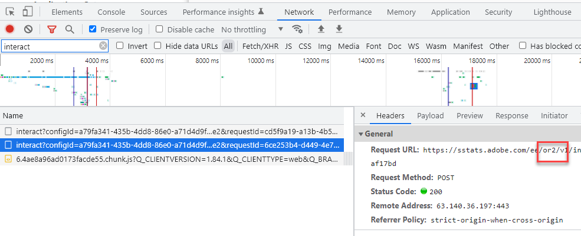

# Platstips för Experience Platform, AAM regionala DCS-noder och Platstips för ID-tjänst

## Beskrivning {#description}

Vilken är relationen mellan AEP WebSDK-platstips, platstips för Experience Cloud ID-tjänsten och AAM regionala DCS-noder och varför är det viktigt att förstå relationen?

## Upplösning {#resolution}

AEP WebSDK (som skickar data till Experience Edge) och Adobe Audience Manager (AAM) datainsamling i realtid sker på regionala noder som är spridda över hela världen. Det finns sju regionala noder och AEP WebSDK/Experience Edge och AAM datainsamling använder samma noder. AAM datainsamlingsservrar (DCS) använder samma nätverksinfrastruktur som Experience Edge utgör. Eftersom Experience Cloud ID-tjänsten använder AAM-teknik är platstipsen för ID-tjänsten samma som noderna för AAM regionala datainsamling. AAM DCS-noder = Platstips för ID-tjänst = Experience Edge-platstips. AAM regionala noder beskrivs här [dokumentation](https://experienceleague.adobe.com/docs/audience-manager/user-guide/api-and-sdk-code/dcs/dcs-api-reference/dcs-regions.html?lang=en), medan samma Experience Edge regionala noder beskrivs i detta [dokumentation](https://experienceleague.adobe.com/docs/experience-platform/edge-network-server-api/location-hints.html?lang=en).

Även om AAM regionala noder och platstips för ID-tjänster identifieras av siffror och Experience Edge identifieras av alfanumeriska tecken, kommer du att märka att de alla justeras mot samma områden (förutom Brasilien).  Uppslagstabellen nedan visar hur de är ordnade:

| Tips för Experience Edge Location | Platstips för AAM DCS-regionnod/ID-tjänst |
| --- | --- |
| spg3 | ID: 3 Värd: apse.demdex.net |
| irl1 | ID: 6 Värd: irl1.demdex.net |
| va6 | ID: 7-värd: use.demdex.net |
| aus3 | ID: 8-värd: apse2.demdex.net |
| or2 | ID: 9 Värd: usw2.demdex.net |
| jpn3 | ID: 11 Värd: tyo3.demdex.net |
| ind1 | ID: 12 Värd: ind1.demdex.net |

De flesta Adobe Experience Cloud-funktioner som kräver realtidssvar använder dessa regionala noder. Det första anropet till ID-tjänsten eller Experience Edge-anropet på en webbsida eller mobilapp avgör vilken regional nod som ska användas. Platstipsen hittar du som svar på dessa anrop:

Experience Cloud ID-tjänst:

AEP Web SDK:

När den närmaste regionala noden för slutanvändaren har fastställts, skickas regionidentifieraren via Analytics-, Target- och AEP WebSDK-anrop framåt. I Analytics skickas den som aamlh-frågesträngsparametern:

I Target skickas det i objektet experienceCloud.auditionManager.locationHint för nyttolasten för begäran:

För AEP Web SDK uppdateras samtalssökvägen till den regionala noden:

<b>Obs! </b>Det första interaktiva anropet från AEP WebSDK har INTE regionen i sökvägen eftersom regionen ännu inte har fastställts, men platstipset är i svaret (vilket beskrivs ovan). Sökvägen för den ursprungliga begäran är bara ..../ee/v1/... Efterföljande anrop kommer dock att innehålla den regionala nodinformationen mellan sökvägselementen /ee/ och /v1/

Dessa parametrar säkerställer att vidarebefordrade analysdata på serversidan vidarebefordras till rätt AAM edge-nod, att Target begär segmentinformation från samma edge-nod och att [AEP-data skickar data till AAM](https://experienceleague.adobe.com/docs/audience-manager/user-guide/implementation-integration-guides/integration-experience-platform/aam-aep-audience-sharing.html?lang=en) (och målgruppsbibliotekets) korrigera regional nod.

Den här informationen är viktig att veta när du skickar träffar på server- eller klientsidan på icke-standardiserade sätt till Adobe-lösningar. Till exempel måste ett manuellt konstruerat AEP WebSDK-anrop på en sida enbart för synkronisering av ett ECID med en AEP-profil skickas till rätt regional Experience Edge-nod. Om så inte är fallet kommer alla data som delas från AEP till AAM att gå till den AAM backend-databasen och sedan ta ytterligare 48 timmar för AAM att överföra dessa data till varje edge-nod, vilket drastiskt bromsar tiden Target kan använda alla AEP-segment som skickas till AAM (eller till Audience Library). Eller om en Analytics-begäran skickas till nod 7 på serversidan, men användarens Target-implementering på sidan använder region 9, vidarebefordras data till AAM Östra noden, medan Target pingar noden US West för segmentinformation. Slutanvändaren skulle inte kunna kvalificera sig för målaktiviteter med målgrupper/AAM i målbiblioteket förrän slutnoderna synkroniseras 24-48 timmar senare. Det är standardpraxis i användningsfall som dessa att få ett ECID med [getMarketingCloudVisitorID](https://experienceleague.adobe.com/docs/id-service/using/id-service-api/methods/getmcvid.html?lang=en) (ID-tjänst) eller [getIdentity](https://experienceleague.adobe.com/docs/experience-platform/edge/extension/accessing-the-ecid.html?lang=en) (Web SDK) funktioner. Förutom att hämta ECID måste platstipset också hämtas och användas med [getLocationHint](https://experienceleague.adobe.com/docs/id-service/using/id-service-api/methods/getlocationhint.html?lang=en) (ID-tjänst) eller genom att hämta den från svarsnyttolasten för Web SDK-anrop.

