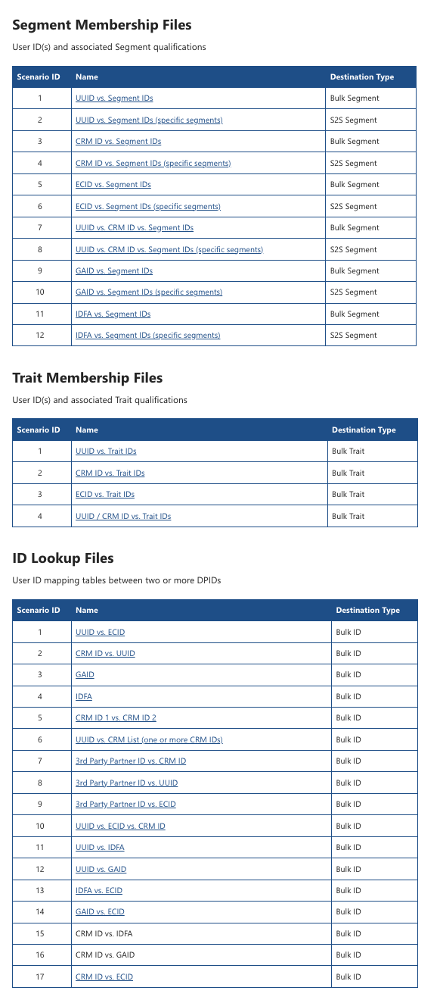

# Alternativ för massexport

Lär dig exportera stora mängder data från Audience Manager med dessa grundläggande exportalternativ.

## Beskrivning {#description}

<b>Miljö </b>

Adobe Audience Manager

<b>Problem/symtom</b>

Exportera stora mängder data från Audience Manager med dessa grundläggande exportalternativ. Öppna ett ärende hos kundtjänst för att begära konfiguration av en viss export.

Med massexport i enkla termer kopierar du data från en SQL-server till en datafil. Detta är viktigt för att hantera och importera massdata på ett smidigt sätt.

## Upplösning {#resolution}

