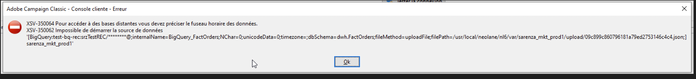

# Fel: XSV-350064 i det externa Google BigQuery-kontot

## Beskrivning {#description}

<b>Miljö</b> Campaign Classic v7   <b>Problem/symtom</b> Vid försök att konfigurera det externa kontot för <b>Google BigQuery</b> när vi klickar på en testanslutning visas följande fel:
  XSV-350064 - Om du vill komma åt fjärrdatabaser måste du ange datatidszonen XSV-350062 - Det gick inte att starta datakällan    
<b>Steg som ska följas:</b>

- Gå till Externa konton.
- Klicka på <b>Skapa och välj typ</b> och markera <b>Big Query Google</b> och fylla i alla andra uppgifter.
- Klicka på <b>Testa anslutningen</b> och sedan visas ett fel.

## Upplösning {#resolution}

För att återställa fältets värde `timezone`måste du ändra texten till <b>PostgreSQL</b> (som har en *tidszon* i användargränssnittet) och här kan du välja ett värde och sedan spara det externa kontot.

Därefter ändrar du texten till <b>Google Big Query </b>igen och ersätta gamla data och kontrollera <b>Redigera XML-fil</b> (this should now have a value for *tidszon*).

Testa även anslutningen igen och kontrollera att det inte finns fler fel i tidszonen.

<b>Orsak:</b>
När vi har kontrollerat Redigera XML-fil ser vi att det inte finns något värde för *tidszon* fält (`timezone=""`)

