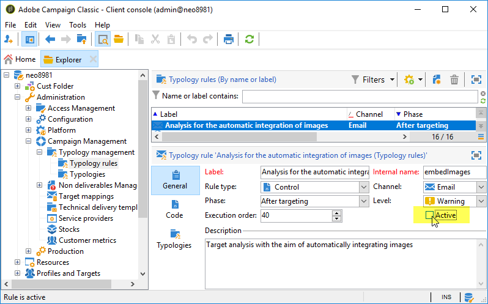

# Hur förhindrar man långsam e-postleverans på grund av Deco-mail-mottagare?

## Beskrivning {#description}

<b>Miljö</b>

- Adobe Campaign Classic (ACC)
- Adobe Campaign Standard (ACS)

<b>Problem/symtom</b>

E-postkanalsleveransen kan vara mycket långsam om målpopulationen innehåller mottagare med <b>Deco-mail</b> e-postformat.

En mottagare har en <b>Deco-mail</b> e-postformat i något av eller båda följande fall:

1. Dess e-postformat anges uttryckligen till något av följande:
   - Deco-mail (DoCoMo)
   - Dekoration Mail (KDDI AU)
   - Dekorera post (Softbank)         
2. E-postdomänen är konfigurerad som `Image inclusion=yes`in:
   - <b>Campaign Management</b> › <b>Hantering som inte kan levereras</b> › <b>Hantering av meddelandeformat</b>        

## Upplösning {#resolution}

Prova följande för att förhindra den här långsamma leveransen:

- Rensa målpopulationen så att den inte innehåller någon dekormottagare.
- Designa arbetsflödet så att det inte tar emot Deco-mail-mottagare från målgruppen.
- Stäng av <b>Analys av automatisk integration av bilder</b>.

  

<b>Orsak</b>

Om mottagaren har ett Deco-mail-format används typologiregeln i Campaign - <b>Analys av automatisk integration av bilder</b>. Det omvandlar bildlänkar i e-postmeddelandet till Deco-mail-mottagaren till bifogade bildfiler. Den totala leveransstorleken kan bli mycket stor och dataflödet kan minska avsevärt.
